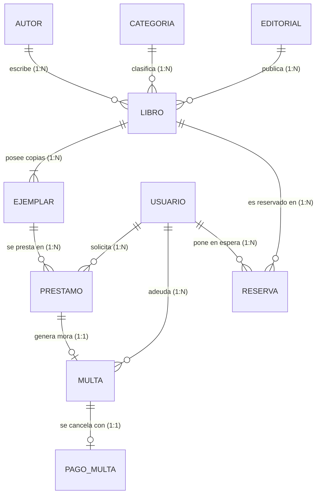

# 📚 Sistema de Gestión de Biblioteca - API RESTful Integral

> **Manual de Referencia Técnica y Documentación Integral del Proyecto**  
> **Asignatura:** Desarrollo Web Integrado  
> **Tecnologías:** Java 21 LTS | Spring Boot | Spring Data JPA | PostgreSQL | Spring Security | JSON Web Tokens (JWT) | Lombok | Bean Validation  
> **Arquitectura:** Arquitectura en Capas (Controller - Service - Repository - Entity) con Persistencia Relacional y Autenticación Stateless  

---

## 📑 Tabla de Contenidos
1. [Introducción y Objetivos](#-introducción-y-objetivos)
2. [Arquitectura y Tecnologías](#-arquitectura-y-tecnologías)
3. [Modelo de Dominio y Base de Datos (PostgreSQL)](#-modelo-de-dominio-y-base-de-datos-postgresql)
   - [3.1. Concepto Clave: Libro (ISBN) vs. Ejemplar Físico](#31-concepto-clave-libro-isbn-vs-ejemplar-físico)
   - [3.2. Ciclo de Fechas (LocalDateTime) y Cálculo Automático de Multas](#32-ciclo-de-fechas-localdatetime-y-cálculo-automático-de-multas)
   - [3.3. Diagrama Entidad-Relación](#33-diagrama-entidad-relación)
   - [3.4. Diccionario de Tablas](#34-diccionario-de-tablas)
4. [Módulo de Seguridad y Autenticación (Spring Security & JWT)](#-módulo-de-seguridad-y-autenticación-spring-security--jwt)
5. [Catálogo Completo de Endpoints RESTful](#-catálogo-completo-de-endpoints-restful)
   - [5.1. Autenticación y Cuentas](#51-autenticación-y-cuentas)
   - [5.2. Catálogo de Libros y Ejemplares](#52-catálogo-de-libros-y-ejemplares)
   - [5.3. Usuarios y Consultas Detalladas](#53-usuarios-y-consultas-detalladas)
   - [5.4. Préstamos y Devoluciones](#54-préstamos-y-devoluciones)
   - [5.5. Multas y Pagos](#55-multas-y-pagos)
   - [5.6. Reservas](#56-reservas)
   - [5.7. Reportes y Métricas](#57-reportes-y-métricas)
6. [Guía de Instalación y Despliegue](#-guía-de-instalación-y-despliegue)
7. [Suite de Pruebas y Colección Postman](#-suite-de-pruebas-y-colección-postman)

---

## 🎯 Introducción y Objetivos

El **Sistema de Gestión de Biblioteca** es una solución Backend de alto rendimiento construida con **Java 21** y **Spring Boot**, diseñada para automatizar y administrar el ciclo de vida de los materiales bibliográficos, el control de inventario físico, los préstamos de usuarios y la fiscalización financiera de sanciones por mora o deterioro.

### Objetivos Principales:
* **Catalogación por ISBN:** Administrar títulos bibliográficos utilizando el código estándar internacional `ISBN` como identificador único natural.
* **Control de Ejemplares Físicos:** Gestionar múltiples copias tangibles por cada libro, controlando su ubicación en estantería y estado de conservación individual.
* **Trazabilidad Temporal Precisa:** Utilizar `LocalDateTime` para calcular con exactitud retrasos en horas/días y emitir sanciones económicas de forma automática.
* **Auditoría de Pagos:** Registrar transacciones de pago de multas con generación de comprobantes y levantamiento automático de sanciones.
* **Seguridad Robusta:** Proteger los recursos mediante **Spring Security**, control de roles (`ADMIN`, `BIBLIOTECARIO`, `ESTUDIANTE`, `DOCENTE`) y autenticación basada en tokens **JWT**.

---

## 🛠️ Arquitectura y Tecnologías

```
src/main/java/com/proyecto/biblioteca/
├── BibliotecaApplication.java        # Punto de entrada de la aplicación Spring Boot
├── config/
│   └── DataInitializer.java         # Sembrado automático de datos iniciales en PostgreSQL
├── controllers/                     # Capa de Controladores REST (@RestController)
│   ├── AuthController.java          # Login, Registro y Perfil
│   ├── LibroController.java         # Catálogo por ISBN
│   ├── EjemplarController.java      # Copias físicas
│   ├── UsuarioController.java       # Usuarios y préstamos detallados
│   ├── PrestamoController.java      # Circulación y devoluciones
│   ├── MultaController.java         # Sanciones y pagos
│   ├── PagoMultaController.java     # Auditoría de cobros
│   ├── ReservaController.java       # Colas de espera
│   ├── AutorController.java
│   ├── CategoriaController.java
│   ├── EditorialController.java
│   ├── ReporteController.java
│   └── GlobalExceptionHandler.java  # Respuestas estandarizadas de error
├── dto/                             # Data Transfer Objects
│   ├── AuthResponseDTO.java
│   ├── LoginRequestDTO.java
│   ├── RegisterRequestDTO.java
│   ├── DevolucionRequestDTO.java
│   ├── PagoMultaRequestDTO.java
│   └── PrestamoDetalladoDTO.java
├── models/                          # Entidades JPA (@Entity)
│   ├── Autor.java
│   ├── Categoria.java
│   ├── Editorial.java
│   ├── Libro.java
│   ├── Ejemplar.java
│   ├── Usuario.java
│   ├── Prestamo.java
│   ├── Multa.java
│   ├── PagoMulta.java
│   └── Reserva.java
├── repositories/                    # Repositorios Spring Data JPA
└── security/                        # Componentes de Seguridad
    ├── SecurityConfig.java          # Configuración de filtros, CORS y rutas
    ├── JwtUtils.java                # Generación y validación de tokens
    ├── JwtAuthenticationFilter.java # Interceptor Bearer Token
    ├── JwtAuthenticationEntryPoint.java # Manejador 401 Unauthorized
    └── CustomUserDetailsService.java
```

---

## 🗄️ Modelo de Dominio y Base de Datos (PostgreSQL)

### 3.1. Concepto Clave: Libro (ISBN) vs. Ejemplar Físico

* **`Libro` (Obra Intelectual):** Se identifica unívocamente por su código **`isbn`** (String). No posee un identificador numérico autoincremental artificial.
* **`Ejemplar` (Copia Tangible):** Representa cada libro físico ubicado en estantes. Un mismo `ISBN` tiene $N$ ejemplares (Copia #1, Copia #2, etc.), cada uno con su propio estado (`DISPONIBLE`, `PRESTADO`, `EN_MANTENIMIENTO`, `DADO_DE_BAJA`) y estado de conservación (`EXCELENTE`, `BUENO`, `DETERIORADO`).
* **Enlace:** En los préstamos se presta un **`Ejemplar` específico** y no el libro abstracto.

---

### 3.2. Ciclo de Fechas (LocalDateTime) y Cálculo Automático de Multas

El sistema registra tres instantes de tiempo para cada préstamo:
1. `fechaHoraPrestamo`: Momento en que se retira el libro físico.
2. `fechaHoraDevolucionEsperada`: Plazo límite pactado (14 días por defecto).
3. `fechaHoraDevolucionReal`: Momento en que el usuario retorna el libro a la biblioteca.

$$\text{Mora} = \text{fechaHoraDevolucionReal} - \text{fechaHoraDevolucionEsperada}$$

* **Si $\text{Mora} \le 0$:** Devolución puntual o anticipada $\implies$ Préstamo marcado como `DEVUELTO`, ejemplar vuelve a `DISPONIBLE`, **sin multa**.
* **Si $\text{Mora} > 0$:** Devolución tardía $\implies$ Se calculan días de retraso, se genera una **`Multa` automática** ($\text{Días} \times \text{Tarifa diaria}$) y el usuario pasa a estado **`SANCIONADO`** (bloqueado para nuevos préstamos hasta que cancele su deuda).

---

### 3.3. Diagrama Entidad-Relación



---

## 🔒 Módulo de Seguridad y Autenticación (Spring Security & JWT)

* **Tokens JWT:** Firma criptográfica HMAC-SHA256 con tiempo de expiración configurable.
* **Contraseñas:** Hash unidireccional con **BCrypt**.
* **Control de Acceso:**
  * **Público:** Catálogo general (`GET /api/libros/**`, `/api/ejemplares/**`), login (`POST /api/auth/login`) y registro (`POST /api/auth/register`).
  * **Protegido (Requiere Token Bearer):** Registro de préstamos, devoluciones, pagos de multas, reservas y modificaciones de catálogo.

### Credenciales de Prueba Precargadas:
| Rol | Email | Contraseña |
|---|---|---|
| **Administrador** | `admin@biblioteca.com` | `admin123` |
| **Bibliotecario** | `bibliotecario@biblioteca.com` | `biblio123` |
| **Estudiante** | `carlos.mendoza@email.com` | `carlos123` |
| **Docente** | `lucia.fernandez@email.com` | `lucia123` |

---

## 📡 Catálogo Completo de Endpoints RESTful

### 5.1. Autenticación y Cuentas (`/api/auth`)
* `POST /api/auth/login` $\rightarrow$ Iniciar sesión y obtener JWT.
* `POST /api/auth/register` $\rightarrow$ Registrar nuevo lector o usuario.
* `GET /api/auth/me` $\rightarrow$ Consultar perfil del usuario autenticado actual.

### 5.2. Catálogo de Libros y Ejemplares
* `GET /api/libros` $\rightarrow$ Listar todos los libros.
* `GET /api/libros/{isbn}` $\rightarrow$ Buscar libro por código ISBN.
* `GET /api/libros/{isbn}/ejemplares` $\rightarrow$ Listar copias físicas de un ISBN.
* `GET /api/libros/{isbn}/ejemplares/disponibles` $\rightarrow$ Listar copias disponibles para préstamo.
* `POST /api/libros` $\rightarrow$ Registrar nuevo libro.
* `PUT /api/libros/{isbn}` $\rightarrow$ Modificar ficha bibliográfica.
* `DELETE /api/libros/{isbn}` $\rightarrow$ Dar de baja un libro.
* `GET /api/ejemplares` $\rightarrow$ Listar todos los ejemplares físicos.
* `POST /api/ejemplares` $\rightarrow$ Dar de alta un nuevo ejemplar físico en estantería.

### 5.3. Usuarios y Consultas Detalladas (`/api/usuarios`)
* `GET /api/usuarios` $\rightarrow$ Listar padrón de usuarios.
* `GET /api/usuarios/{id}` $\rightarrow$ Obtener usuario por ID.
* `GET /api/usuarios/{id}/prestamos` $\rightarrow$ **Historial detallado completo de préstamos** (con datos del libro, ejemplar y estado de mora).
* `GET /api/usuarios/{id}/prestamos/activos` $\rightarrow$ **Libros que el usuario tiene actualmente en su poder**.
* `GET /api/usuarios/{id}/multas` $\rightarrow$ Listar multas del usuario.

### 5.4. Préstamos y Devoluciones (`/api/prestamos`)
* `GET /api/prestamos` $\rightarrow$ Listar préstamos.
* `GET /api/prestamos/{id}/detalle` $\rightarrow$ Obtener ficha detallada de un préstamo.
* `POST /api/prestamos` $\rightarrow$ Registrar nuevo préstamo (valida que usuario no esté sancionado y ejemplar disponible).
* `PUT /api/prestamos/{id}/devolver` $\rightarrow$ **Registrar devolución física:** Compara fecha/hora real contra esperada, calcula horas/días de retraso, emite multa automática si hubo mora y actualiza estado del ejemplar.

### 5.5. Multas y Pagos (`/api/multas`, `/api/pagos-multas`)
* `GET /api/multas` $\rightarrow$ Listar todas las sanciones.
* `GET /api/multas/usuario/{id}/pendientes` $\rightarrow$ Consultar deuda pendiente de un usuario.
* `POST /api/multas/{id}/pagar` $\rightarrow$ **Pagar multa:** Registra comprobante, cancela la multa y levanta la sanción del usuario si no tiene más deudas.
* `GET /api/pagos-multas` $\rightarrow$ Historial y auditoría de pagos procesados.

### 5.6. Reservas (`/api/reservas`)
* `GET /api/reservas` $\rightarrow$ Listar reservas activas.
* `POST /api/reservas` $\rightarrow$ Generar reserva para libro agotado.
* `PUT /api/reservas/{id}/cancelar` $\rightarrow$ Cancelar reserva.

### 5.7. Reportes y Métricas (`/api/reportes`)
* `GET /api/reportes/dashboard` $\rightarrow$ Resumen general (títulos, ejemplares disponibles/prestados, usuarios activos/sancionados, finanzas de multas).
* `GET /api/reportes/libros-por-categoria` $\rightarrow$ Distribución temática.
* `GET /api/reportes/prestamos` $\rightarrow$ Préstamos por estado.
* `GET /api/reportes/financiero-multas` $\rightarrow$ Total emitido, recaudado y pendiente de cobro.

---

## 🚀 Guía de Instalación y Despliegue

### 1. Requisitos Previos
* **Java 21 LTS**
* **PostgreSQL 14+**
* **Maven 3.8+** (o utilizar `./mvnw`)

### 2. Configurar Base de Datos
Crear la base de datos en PostgreSQL:
```sql
CREATE DATABASE biblioteca_db;
```

### 3. Configurar Variables de Entorno (Opcional)
En `src/main/resources/application.properties` puedes ajustar o pasar variables de entorno:
```properties
spring.datasource.url=jdbc:postgresql://localhost:5432/biblioteca_db
spring.datasource.username=postgres
spring.datasource.password=postgres
```

### 4. Compilar y Ejecutar
```bash
# Compilar proyecto
./mvnw clean package -DskipTests

# Ejecutar servidor Spring Boot
./mvnw spring-boot:run
```
La aplicación iniciará en `http://localhost:8080`.

---

## 📮 Suite de Pruebas y Colección Postman

Importa el archivo **`ProyectoBiblioteca.postman_collection.json`** en Postman:
1. Haz clic en **Import** en Postman y selecciona el archivo.
2. Ejecuta la petición **`0. Autenticación & JWT -> Login Administrador`** o **`Login Lector`**.
3. El script de prueba guardará automáticamente el token en la variable `{{token}}`.
4. Ejecuta cualquiera de las peticiones protegidas sin necesidad de copiar tokens manualmente.
