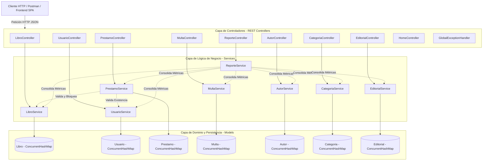
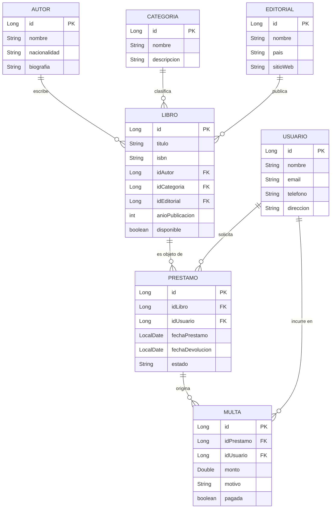

# Proyecto Biblioteca - API RESTful (Spring Boot & Java 21)

> **Documento Integral del Proyecto y Manual de Referencia Técnica**  
> **Asignatura:** Desarrollo Web Integrado  
> **Tecnologías:** Java 21 LTS | Spring Boot 4.x / 3.x | Spring Web MVC | MockMvc & JUnit 5 | Postman  
> **Arquitectura:** Patrón por Capas (Controller - Service - Model) con Persistencia Concurrente In-Memory  

---

# TABLA DE CONTENIDOS
1. [Introducción al Proyecto](#-introducción-al-proyecto)
2. [Capítulo 1: Marco del Proyecto y Definición del Problema](#-capítulo-1-marco-del-proyecto-y-definición-del-problema)
   - [1.1. Definición del problema a solucionar](#11-definición-del-problema-a-solucionar)
   - [1.2. Definición de la solución propuesta](#12-definición-de-la-solución-propuesta)
   - [1.3. Objetivos](#13-objetivos)
     - [1.3.1. Objetivo General](#131-objetivo-general)
     - [1.3.2. Objetivos Específicos](#132-objetivos-específicos)
   - [1.4. Alcances y Limitaciones](#14-alcances-y-limitaciones)
     - [1.4.1. Alcances Funcionales](#141-alcances-funcionales)
     - [1.4.2. Limitaciones del Prototipo](#142-limitaciones-del-prototipo)
   - [1.5. Justificación del Proyecto](#15-justificación-del-proyecto)
3. [Capítulo 2: Marco Teórico y Tecnologías Utilizadas](#-capítulo-2-marco-teórico-y-tecnologías-utilizadas)
   - [2.1. Ecosistema Java 21 LTS](#21-ecosistema-java-21-lts)
   - [2.2. Spring Boot y Spring Web MVC](#22-spring-boot-y-spring-web-mvc)
   - [2.3. Principios RESTful e Intercambio JSON](#23-principios-restful-e-intercambio-json)
   - [2.4. Concurrencia y Persistencia Thread-Safe](#24-concurrencia-y-persistencia-thread-safe)
4. [Capítulo 3: Arquitectura y Diseño de la Solución](#-capítulo-3-arquitectura-y-diseño-de-la-solución)
   - [3.1. Arquitectura en Capas (Layered Architecture)](#31-arquitectura-en-capas-layered-architecture)
   - [3.2. Estructura del Árbol de Paquetes](#32-estructura-del-árbol-de-paquetes)
   - [3.3. Modelo de Dominio y Diccionario de Datos](#33-modelo-de-dominio-y-diccionario-de-datos)
   - [3.4. Diagrama Entidad-Relación Lógico](#34-diagrama-entidad-relación-lógico)
   - [3.5. Matriz de Códigos de Estado HTTP](#35-matriz-de-códigos-de-estado-http)
5. [Capítulo 4: Implementación y Desarrollo del Sistema ("Lo que se ha hecho")](#-capítulo-4-implementación-y-desarrollo-del-sistema-lo-que-se-ha-hecho)
   - [4.1. Punto de Entrada y Configuración del Servidor](#41-punto-de-entrada-y-configuración-del-servidor)
   - [4.2. Controlador Base y Catálogo Raíz](#42-controlador-base-y-catálogo-raíz)
   - [4.3. Implementación de los Controladores REST](#43-implementación-de-los-controladores-rest)
   - [4.4. Capa de Servicios y Motor de Reglas de Negocio](#44-capa-de-servicios-y-motor-de-reglas-de-negocio)
   - [4.5. Datos Semilla Pre-cargados (Seed Data)](#45-datos-semilla-pre-cargados-seed-data)
6. [Capítulo 5: Pruebas Funcionales, Validación y Calidad](#-capítulo-5-pruebas-funcionales-validación-y-calidad)
   - [5.1. Pruebas Automatizadas con Spring Boot Test y MockMvc](#51-pruebas-automatizadas-con-spring-boot-test-y-mockmvc)
   - [5.2. Resultados de Ejecución de Pruebas](#52-resultados-de-ejecución-de-pruebas)
   - [5.3. Suite de Pruebas en Postman](#53-suite-de-pruebas-en-postman)
7. [Capítulo 6: Manual de Instalación, Configuración y Uso](#-capítulo-6-manual-de-instalación-configuración-y-uso)
   - [6.1. Requisitos Previos](#61-requisitos-previos)
   - [6.2. Comandos de Compilación y Ejecución](#62-comandos-de-compilación-y-ejecución)
   - [6.3. Guía de Importación en Postman](#63-guía-de-importación-en-postman)
   - [6.4. Especificación Detallada de Endpoints](#64-especificación-detallada-de-endpoints)
8. [Capítulo 7: Conclusiones y Recomendaciones](#-capítulo-7-conclusiones-y-recomendaciones)
   - [7.1. Conclusiones](#71-conclusiones)
   - [7.2. Recomendaciones y Trabajo Futuro](#72-recomendaciones-y-trabajo-futuro)
9. [Referencias Bibliográficas](#-referencias-bibliográficas)

---

# INTRODUCCIÓN AL PROYECTO

En la era de la información y la transformación digital, las instituciones educativas, culturales y académicas requieren mecanismos ágiles, confiables y automatizados para administrar su capital bibliográfico y los servicios de atención a sus usuarios. Tradicionalmente, la administración de bibliotecas se ha visto obstaculizada por registros manuales en papel, hojas de cálculo descentralizadas o sistemas monolíticos rígidos, los cuales propician extravíos de material bibliográfico, inconsistencias en el inventario, demoras en la atención y dificultades para fiscalizar los préstamos vencidos.

El presente proyecto aborda esta problemática mediante la conceptualización, diseño e implementación de una solución de backend moderna basada en una **API RESTful** construida con **Java 21** y el framework **Spring Boot**. La arquitectura está concebida bajo los principios de separación de responsabilidades (controladores REST, servicios de lógica de negocio, modelos de dominio y repositorios en memoria concurrentes), permitiendo el desacoplamiento total entre el procesamiento de datos del servidor y cualquier futura interfaz de usuario (aplicaciones web SPA en React/Vue/Angular, aplicaciones móviles Android/iOS o quioscos táctiles de autoservicio).

A través de esta implementación, se provee un sistema modular capaz de catalogar el acervo bibliográfico (vinculando libros con sus respectivos autores, categorías y editoriales), gestionar el padrón de lectores, administrar el ciclo de vida de los préstamos con validación de disponibilidad en tiempo real y aplicar penalizaciones o multas económicas ante incidencias o demoras en la restitución de los ejemplares.

---

# CAPÍTULO 1: MARCO DEL PROYECTO Y DEFINICIÓN DEL PROBLEMA

## 1.1. Definición del problema a solucionar

El manejo empírico y desarticulado de los recursos en una biblioteca genera múltiples cuellos de botella operativos que perjudican tanto al personal administrativo como a los usuarios lectores. Entre las principales fallas detectadas se encuentran:

1. **Descontrol en la disponibilidad física de los ejemplares:** La falta de un mecanismo sincronizado permite que un libro sea solicitado o prestado de manera simultánea a más de un lector, generando conflictos de inventario y cancelaciones forzadas.
2. **Pérdida de trazabilidad en los préstamos y devoluciones:** La ausencia de registros sistemáticos de fechas límite de entrega dificulta identificar oportunamente qué usuarios tienen libros en estado de mora.
3. **Gestión ineficiente de penalizaciones y sanciones:** La aplicación de multas por daño o retraso en las devoluciones suele ser subjetiva o no quedar vinculada formalmente al préstamo ni al perfil del infractor, imposibilitando el cobro o la restricción de nuevos préstamos.
4. **Desarticulación en la catalogación editorial y de autores:** La información de los autores, editoriales y géneros literarios suele registrarse con redundancia o nombres contradictorios, lo que entorpece las búsquedas temáticas y el mantenimiento del acervo.
5. **Carencia de interfaces de integración estandarizadas:** Los sistemas tradicionales cerrados impiden la interoperabilidad con tecnologías web modernas, requiriendo una API centralizada que exponga endpoints REST robustos, seguros y basados en el estándar JSON.

---

## 1.2. Definición de la solución propuesta

Como respuesta a las deficiencias señaladas, se plantea el desarrollo de una **API RESTful de alto rendimiento y bajo acoplamiento**, desarrollada en **Java 21** utilizando las capacidades del ecosistema **Spring Boot**. 

La solución se fundamenta en los siguientes pilares de diseño:

- **Estructura en Capas (Layered Architecture):** Desacoplamiento estricto entre la capa de presentación/controladores (`@RestController`), la capa de lógica del negocio (`@Service`) y la capa de modelo (`models`).
- **Motor de Reglas de Negocio en Tiempo Real:** 
  - Al procesar una solicitud de préstamo, el sistema valida la existencia previa del usuario y del ejemplar solicitado.
  - Verifica que el estado del libro sea `disponible == true`. En caso afirmativo, aprueba la transacción y conmuta de manera inmediata el estado a `disponible == false`.
  - Establece de forma automática plazos estandarizados de devolución (por defecto 14 días calendario a partir de la fecha de registro) y asigna el estado de préstamo inicial (`ACTIVO`).
- **Gestión Integral de Sanciones (Multas):** Registro de multas asociadas con llaves foráneas lógicas al préstamo y al usuario, especificando montos adeudados, causal de la falta y estado de pago (`pagada: boolean`).
- **Persistencia Concurrente Thread-Safe:** Implementación de estructuras `ConcurrentHashMap` y generadores atómicos `AtomicLong` que aseguran la consistencia de los datos en memoria ante peticiones simultáneas, facilitando el prototipado y validación de la lógica sin dependencias externas pesadas.
- **Intercambio Estandarizado vía JSON y Códigos HTTP:** Cada recurso responde con códigos de estado semánticos (`200 OK`, `201 Created`, `400 Bad Request`, `404 Not Found`, `409 Conflict`), asegurando una integración fluida con clientes web (React, Vue, Angular) o herramientas de prueba (Postman).

---

## 1.3. Objetivos

### 1.3.1. Objetivo General
Desarrollar e implementar una **API RESTful modular y escalable** en **Java 21** y **Spring Boot** para la automatización y control integral de los procesos bibliotecarios de registro de catálogo, administración de lectores, circulación de préstamos y fiscalización de multas en el marco del curso de **Desarrollo Web Integrado**.

### 1.3.2. Objetivos Específicos
1. **Diseñar y estructurar la arquitectura del software** siguiendo el patrón por capas (Controller - Service - Model) para garantizar un código modular, mantenible y extensible.
2. **Implementar los servicios y endpoints RESTful** para la administración de las 7 entidades del dominio: Libros, Usuarios, Préstamos, Multas, Autores, Categorías y Editoriales.
3. **Codificar las reglas de negocio y validaciones transaccionales**, asegurando la verificación de disponibilidad previa de ejemplares, asignación de fechas de retorno y control de inconsistencias mediante excepciones controladas y respuestas HTTP apropiadas.
4. **Garantizar la concurrencia e integridad de la información en memoria** mediante el uso de estructuras de datos concurrentes (`ConcurrentHashMap`, `AtomicLong`).
5. **Configurar y documentar una suite de pruebas funcionales exhaustiva** en Spring Boot Test / MockMvc y Postman que permita verificar cada método (`GET`, `POST`) y facilite la integración con futuros desarrollos frontend.

---

## 1.4. Alcances y Limitaciones

### 1.4.1. Alcances Funcionales
El sistema abarca los siguientes módulos y funcionalidades operativas:
- **Gestión del Catálogo Bibliográfico:** Registro, consulta individual y listado general de libros, con vinculación a sus respectivos autores, categorías temáticas y casas editoriales.
- **Gestión de Lectores / Usuarios:** Registro de datos personales, correo electrónico, teléfono y dirección domiciliaria.
- **Circulación de Préstamos:** Transacción integral de solicitud de préstamo con verificación automática de disponibilidad y bloqueo instantáneo del ejemplar para evitar duplicidades.
- **Régimen de Multas y Penalizaciones:** Registro y consulta de sanciones económicas asociadas a préstamos morosos o materiales dañados.
- **Entidades de Clasificación y Soporte:** Mantenimiento de catálogos independientes para Autores (datos biográficos y nacionalidad), Categorías (géneros literarios) y Editoriales (país y portal web).
- **Documentación y Pruebas Automatizadas:** Entrega de colección lista para importar en Postman con variables preconfiguradas y endpoints de verificación rápida, respaldada por pruebas unitarias y de integración con MockMvc.

### 1.4.2. Limitaciones del Prototipo
- **Persistencia en Memoria (In-Memory):** En la fase actual del proyecto, los datos residen en la memoria volátil de la aplicación (JVM); al detener o reiniciar el servidor, los registros vuelven a su estado de inicialización predeterminado (semilla de datos). No se incluye en esta fase conexión a un gestor de base de datos relacional (RDBMS como PostgreSQL o MySQL).
- **Alcance de la Capa de Presentación:** El proyecto se enfoca estrictamente en la capa de servicios backend (API REST). La construcción de una interfaz gráfica de usuario (frontend con vistas web o móviles) queda fuera del alcance de este hito de entrega.
- **Seguridad y Autenticación:** No se contemplan esquemas de autenticación basados en tokens (JWT) ni control de accesos basados en roles (RBAC) en esta versión del prototipo.
- **Notificaciones Externas:** No se incluye pasarela de envío de correos electrónicos automatizados ni alertas SMS para avisos de vencimiento de préstamos.

---

## 1.5. Justificación del Proyecto

- **Justificación Técnica:**  
  El uso de **Java 21** (versión con soporte a largo plazo - LTS) en combinación con **Spring Boot** representa el estándar industrial para el desarrollo de microservicios y sistemas empresariales robustos. La arquitectura REST desacoplada permite que la lógica central del negocio sea reutilizable y accesible para múltiples clientes heterogéneos sin requerir modificaciones en el servidor.
  
- **Justificación Académica:**  
  En el contexto de la asignatura **Desarrollo Web Integrado**, el proyecto consolida los conocimientos fundamentales de ingeniería de software moderna: diseño de modelos orientados a objetos, arquitectura de capas, inyección de dependencias, manejo del protocolo HTTP, tratamiento semántico de excepciones y estandarización del formato JSON para el intercambio de datos en la web.
  
- **Justificación Práctica y Social:**  
  La automatización de una biblioteca optimiza los tiempos de espera de los estudiantes e investigadores, previene la pérdida de material educativo costoso y democratiza el acceso a la cultura mediante un control equitativo y transparente de los préstamos disponibles.

---

# CAPÍTULO 2: MARCO TEÓRICO Y TECNOLOGÍAS UTILIZADAS

## 2.1. Ecosistema Java 21 LTS
Java 21 es una versión de soporte extendido (Long-Term Support) que incorpora optimizaciones significativas en rendimiento, manejo de memoria y sintaxis moderna. En este proyecto se aprovechan:
- **API `java.time` (`LocalDate`):** Manejo inmutable y seguro de fechas para registrar préstamos y calcular devoluciones sin desfases por zonas horarias o mutabilidad indeseada.
- **Colecciones Concurrentes (`java.util.concurrent`):** Uso de hilos seguros para almacenamiento en memoria sin cuellos de botella por bloqueos globales de sincronización.
- **Pattern Matching y Métodos Funcionales (`Optional`, Streams):** Claridad semántica al buscar entidades opcionales y transformaciones de listas.

## 2.2. Spring Boot y Spring Web MVC
Spring Boot simplifica el ciclo de desarrollo de aplicaciones empresariales eliminando configuraciones manuales complejas:
- **Inversión de Control (IoC) e Inyección de Dependencias (DI):** Los controladores reciben instancias de los servicios a través de sus constructores (`Constructor Injection`), facilitando el desacoplamiento y la comprobación mediante pruebas unitarias.
- **Anotaciones Clave:**
  - `@SpringBootApplication`: Punto de arranque que habilita auto-configuración y escaneo de componentes.
  - `@RestController`: Especialización de `@Controller` que serializa automáticamente las respuestas a formato JSON mediante Jackson.
  - `@RequestMapping`, `@GetMapping`, `@PostMapping`: Enrutamiento declarativo de verbos y rutas HTTP.
  - `@Service`: Registro de clases como componentes de la capa de lógica empresarial en el contenedor de Spring.
  - `@RequestBody` y `@PathVariable`: Enlace automático de datos de entrada desde el cuerpo JSON o parámetros de URL.

## 2.3. Principios RESTful e Intercambio JSON
El sistema sigue las restricciones del estilo de arquitectura REST:
- **Protocolo sin estado (Stateless):** Cada solicitud contiene toda la información necesaria para ser procesada.
- **Identificación de recursos por URIs:** Rutas semánticas y pluralizadas (`/api/libros`, `/api/prestamos`).
- **Uso de Verbos HTTP estándar:** `GET` para recuperación segura de recursos y `POST` para creación y transacciones de negocio.
- **Formato Estándar JSON (`application/json`):** Estructura ligera, interoperable y de lectura humana.

## 2.4. Concurrencia y Persistencia Thread-Safe
Para simular un motor de base de datos sin introducir la sobrecarga de un motor SQL en esta primera etapa, se empleó:
- **`ConcurrentHashMap<Long, T>`:** Proporciona operaciones de lectura y escritura altamente concurrentes con segmentación interna, evitando colisiones de hilos en servidores multi-petición como Tomcat embebido.
- **`AtomicLong`:** Asegura que los identificadores autoincrementales (`ID`) sean generados de forma atómica y unívoca, garantizando la integridad de claves primarias.

---

# CAPÍTULO 3: ARQUITECTURA Y DISEÑO DE LA SOLUCIÓN

## 3.1. Arquitectura en Capas (Layered Architecture)

La aplicación implementa una estricta separación de responsabilidades en tres capas fundamentales:



---

## 3.2. Estructura del Árbol de Paquetes

La solución se organizó de forma limpia bajo el paquete raíz `com.proyecto.biblioteca`:

```
src/main/java/com/proyecto/biblioteca/
├── BibliotecaApplication.java        # Punto de entrada y arranque Spring Boot
├── controllers/                     # Controladores REST que exponen los endpoints
│   ├── HomeController.java          # Endpoint raíz '/' de información y estado
│   ├── LibroController.java         # Operaciones CRUD sobre /api/libros
│   ├── UsuarioController.java       # Operaciones CRUD sobre /api/usuarios
│   ├── PrestamoController.java      # Operaciones CRUD y lógica de /api/prestamos
│   ├── MultaController.java         # Operaciones CRUD sobre /api/multas
│   ├── AutorController.java         # Operaciones CRUD sobre /api/autores
│   ├── CategoriaController.java     # Operaciones CRUD sobre /api/categorias
│   ├── EditorialController.java     # Operaciones CRUD sobre /api/editoriales
│   ├── ReporteController.java       # Endpoints de analítica sobre /api/reportes
│   └── GlobalExceptionHandler.java  # Captura global de errores Bean Validation
├── models/                          # Clases POJO con Lombok y Bean Validation
│   ├── Libro.java                   # Entidad Libro (disponibilidad y restricciones)
│   ├── Usuario.java                 # Entidad Usuario / Lector (validación email)
│   ├── Prestamo.java                # Entidad Préstamo (fechas y estado)
│   ├── Multa.java                   # Entidad Multa (sanción económica y estado)
│   ├── Autor.java                   # Entidad Autor
│   ├── Categoria.java               # Entidad Categoría temática
│   └── Editorial.java               # Entidad Editorial
└── services/                        # Servicios Spring con persistencia thread-safe
    ├── LibroService.java            # Lógica de catálogo y disponibilidad
    ├── UsuarioService.java          # Lógica de padrón de usuarios
    ├── PrestamoService.java         # Reglas transaccionales de préstamos
    ├── MultaService.java            # Reglas de validación de multas
    ├── AutorService.java            # Catálogo de autores
    ├── CategoriaService.java        # Catálogo de categorías
    ├── EditorialService.java        # Catálogo de editoriales
    └── ReporteService.java          # Consolidación y reportes analíticos
```

---

## 3.3. Modelo de Dominio y Diccionario de Datos

El sistema modela 7 entidades principales para reflejar con exactitud la operativa de una biblioteca real:

| Entidad | Campo | Tipo Java | Descripción / Restricciones |
| :--- | :--- | :--- | :--- |
| **`Libro`** | `id` | `Long` | Identificador único autoincremental |
| | `titulo` | `String` | Nombre o título de la obra |
| | `isbn` | `String` | Código identificador internacional de libro |
| | `idAutor` | `Long` | Llave foránea lógica a `Autor` |
| | `idCategoria` | `Long` | Llave foránea lógica a `Categoria` |
| | `idEditorial` | `Long` | Llave foránea lógica a `Editorial` |
| | `anioPublicacion` | `int` | Año de edición de la obra |
| | `disponible` | `boolean` | `true`: apto para préstamo; `false`: en circulación |
| **`Usuario`** | `id` | `Long` | Identificador único del lector |
| | `nombre` | `String` | Nombres y apellidos completos |
| | `email` | `String` | Correo electrónico de contacto |
| | `telefono` | `String` | Número telefónico |
| | `direccion` | `String` | Dirección física de residencia |
| **`Prestamo`**| `id` | `Long` | Identificador único de la transacción |
| | `idLibro` | `Long` | Llave foránea lógica al ejemplar prestado |
| | `idUsuario` | `Long` | Llave foránea lógica al lector prestatario |
| | `fechaPrestamo` | `LocalDate` | Fecha de entrega del material (por defecto hoy) |
| | `fechaDevolucion`| `LocalDate` | Fecha máxima de restitución (hoy + 14 días) |
| | `estado` | `String` | Estado operativo: `ACTIVO`, `DEVUELTO`, `VENCIDO` |
| **`Multa`** | `id` | `Long` | Identificador único de la sanción |
| | `idPrestamo` | `Long` | Llave foránea lógica al préstamo que originó la falta |
| | `idUsuario` | `Long` | Llave foránea lógica al infractor |
| | `monto` | `Double` | Valor monetario de la multa (debe ser > 0) |
| | `motivo` | `String` | Justificación (retraso, rotura de hojas, pérdida) |
| | `pagada` | `boolean` | `false`: deuda pendiente; `true`: regularizada |
| **`Autor`** | `id` | `Long` | Identificador del autor |
| | `nombre` | `String` | Nombre literario / oficial |
| | `nacionalidad` | `String` | País de origen |
| | `biografia` | `String` | Breve reseña biográfica |
| **`Categoria`**| `id` | `Long` | Identificador de la clasificación |
| | `nombre` | `String` | Nombre del género o tema |
| | `descripcion` | `String` | Alcance de la materia bibliográfica |
| **`Editorial`**| `id` | `Long` | Identificador de la casa editorial |
| | `nombre` | `String` | Razón social o marca editorial |
| | `pais` | `String` | País de la sede central |
| | `sitioWeb` | `String` | Portal oficial en internet |

---

## 3.4. Diagrama Entidad-Relación Lógico



---

## 3.5. Matriz de Códigos de Estado HTTP

El diseño de la API se apega a la semántica HTTP oficial:

| Código HTTP | Significado Semántico | Escenario en la API |
| :--- | :--- | :--- |
| `200 OK` | Petición exitosa | Listados generales (`GET`) o búsqueda individual encontrada por ID |
| `201 Created` | Recurso creado exitosamente | Creación de Libros, Usuarios, Préstamos, Multas, Autores, etc. |
| `400 Bad Request` | Parámetros inválidos o faltantes | Petición de préstamo sin IDs obligatorios, o IDs de libro/usuario inexistentes |
| `404 Not Found` | Recurso no encontrado | Consulta por ID inexistente (`/api/libros/999`) |
| `409 Conflict` | Conflicto con el estado actual | Intento de prestar un libro cuyo estado actual es `disponible == false` |

---

# 🛠️ CAPÍTULO 4: IMPLEMENTACIÓN Y DESARROLLO DEL SISTEMA ("LO QUE SE HA HECHO")

En este capítulo se detalla exhaustivamente el trabajo técnico realizado, explicando componente por componente cómo se estructuró la solución, las decisiones de código tomadas y los mecanismos implementados.

## 4.1. Punto de Entrada y Configuración del Servidor

El arranque del microservicio se gestiona mediante [`BibliotecaApplication.java`](file:///c:/Users/Ronal%20Llapapasca/Documents/Universidad/2026-2/Desarrollo%20Web%20Integrado/ProyectoBiblioteca/src/main/java/com/proyecto/biblioteca/BibliotecaApplication.java):

```java
package com.proyecto.biblioteca;

import org.springframework.boot.SpringApplication;
import org.springframework.boot.autoconfigure.SpringBootApplication;

@SpringBootApplication
public class BibliotecaApplication {
    public static void main(String[] args) {
        SpringApplication.run(BibliotecaApplication.class, args);
    }
}
```
- Se ejecuta sobre un servidor Tomcat embebido en el puerto por defecto `8080`.
- La anotación `@SpringBootApplication` activa el escaneo automático de componentes en el paquete `com.proyecto.biblioteca` y sus subpaquetes (`controllers`, `services`, `models`).

---

## 4.2. Controlador Base y Catálogo Raíz

Para permitir que cualquier desarrollador o evaluador conozca el catálogo y compruebe la operatividad del sistema de forma inmediata, se implementó [`HomeController.java`](file:///c:/Users/Ronal%20Llapapasca/Documents/Universidad/2026-2/Desarrollo%20Web%20Integrado/ProyectoBiblioteca/src/main/java/com/proyecto/biblioteca/controllers/HomeController.java):

- **Ruta `/` (`GET`):** Devuelve un mapa JSON con el nombre del sistema, el estado operativo (`"Activo"`), la versión y un diccionario navegable con todos los endpoints disponibles.
- **Rutas `/hello` y `/saludo` (`GET`):** Proveen mensajes de bienvenida listos para pruebas rápidas de conectividad desde el navegador o clientes HTTP ligeros.

---

## 4.3. Implementación de los Controladores REST

Se codificaron 7 controladores especializados que exponen operaciones `GET` (listado y búsqueda por ID) y `POST` (registro con respuesta `201 Created`):

1. **[`LibroController.java`](file:///c:/Users/Ronal%20Llapapasca/Documents/Universidad/2026-2/Desarrollo%20Web%20Integrado/ProyectoBiblioteca/src/main/java/com/proyecto/biblioteca/controllers/LibroController.java):**  
   - `GET /api/libros`: Retorna el catálogo completo en formato JSON.
   - `GET /api/libros/{id}`: Retorna `200 OK` con el libro o `404 Not Found` si no existe.
   - `POST /api/libros`: Recibe los datos del libro, inicializa `disponible = true` y responde `201 Created`.

2. **[`UsuarioController.java`](file:///c:/Users/Ronal%20Llapapasca/Documents/Universidad/2026-2/Desarrollo%20Web%20Integrado/ProyectoBiblioteca/src/main/java/com/proyecto/biblioteca/controllers/UsuarioController.java):**  
   - `GET /api/usuarios`: Retorna la lista de usuarios registrados.
   - `GET /api/usuarios/{id}`: Búsqueda individual de lectores.
   - `POST /api/usuarios`: Inserta un nuevo usuario asignándole ID autoincremental.

3. **[`PrestamoController.java`](file:///c:/Users/Ronal%20Llapapasca/Documents/Universidad/2026-2/Desarrollo%20Web%20Integrado/ProyectoBiblioteca/src/main/java/com/proyecto/biblioteca/controllers/PrestamoController.java):**  
   - Maneja el ciclo de préstamos capturando excepciones de negocio mediante bloques `try-catch`:
     - `IllegalArgumentException` $\rightarrow$ Responde `400 Bad Request` con mensaje descriptivo (ej. "El id del libro y el id del usuario son obligatorios").
     - `IllegalStateException` $\rightarrow$ Responde `409 Conflict` cuando el libro ya se encuentra prestado.
     - Éxito $\rightarrow$ Responde `201 Created` con el préstamo registrado y fechas autocalculadas.

4. **[`MultaController.java`](file:///c:/Users/Ronal%20Llapapasca/Documents/Universidad/2026-2/Desarrollo%20Web%20Integrado/ProyectoBiblioteca/src/main/java/com/proyecto/biblioteca/controllers/MultaController.java):**  
   - Valida que el monto sea estrictamente mayor a 0 y que el usuario esté identificado, retornando `400 Bad Request` ante inconsistencias.

5. **[`AutorController.java`](file:///c:/Users/Ronal%20Llapapasca/Documents/Universidad/2026-2/Desarrollo%20Web%20Integrado/ProyectoBiblioteca/src/main/java/com/proyecto/biblioteca/controllers/AutorController.java), [`CategoriaController.java`](file:///c:/Users/Ronal%20Llapapasca/Documents/Universidad/2026-2/Desarrollo%20Web%20Integrado/ProyectoBiblioteca/src/main/java/com/proyecto/biblioteca/controllers/CategoriaController.java), [`EditorialController.java`](file:///c:/Users/Ronal%20Llapapasca/Documents/Universidad/2026-2/Desarrollo%20Web%20Integrado/ProyectoBiblioteca/src/main/java/com/proyecto/biblioteca/controllers/EditorialController.java):**  
   - Permiten la administración de las tablas maestras de clasificación editorial y biográfica.

---

## 4.4. Capa de Servicios y Motor de Reglas de Negocio

La lógica central y las validaciones de negocio residen en la capa de servicios, desacoplada de la capa web.

### 4.4.1. Transacción de Préstamo con Bloqueo de Disponibilidad
En [`PrestamoService.java`](file:///c:/Users/Ronal%20Llapapasca/Documents/Universidad/2026-2/Desarrollo%20Web%20Integrado/ProyectoBiblioteca/src/main/java/com/proyecto/biblioteca/services/PrestamoService.java) se implementó la regla más crítica del sistema:

```java
public Prestamo registrarPrestamo(Prestamo prestamo) {
    if (prestamo.getIdLibro() == null || prestamo.getIdUsuario() == null) {
        throw new IllegalArgumentException("El id del libro y el id del usuario son obligatorios");
    }

    // 1. Validar existencia del libro
    var libroOpt = libroService.buscarPorId(prestamo.getIdLibro());
    if (libroOpt.isEmpty()) {
        throw new IllegalArgumentException("No existe el libro con ID: " + prestamo.getIdLibro());
    }

    // 2. Validar disponibilidad física del ejemplar
    var libro = libroOpt.get();
    if (!libro.isDisponible()) {
        throw new IllegalStateException("El libro '" + libro.getTitulo() + "' no se encuentra disponible para préstamo");
    }

    // 3. Validar existencia del usuario lector
    var usuarioOpt = usuarioService.buscarPorId(prestamo.getIdUsuario());
    if (usuarioOpt.isEmpty()) {
        throw new IllegalArgumentException("No existe el usuario con ID: " + prestamo.getIdUsuario());
    }

    // 4. Conmutar disponibilidad a false (bloqueo inmediato)
    libroService.actualizarDisponibilidad(libro.getId(), false);

    // 5. Asignar fechas por defecto: fecha de hoy y plazo de devolución a 14 días
    if (prestamo.getFechaPrestamo() == null) {
        prestamo.setFechaPrestamo(LocalDate.now());
    }
    if (prestamo.getFechaDevolucion() == null) {
        prestamo.setFechaDevolucion(prestamo.getFechaPrestamo().plusDays(14));
    }
    if (prestamo.getEstado() == null || prestamo.getEstado().isBlank()) {
        prestamo.setEstado("ACTIVO");
    }

    return guardar(prestamo);
}
```

### 4.4.2. Inyección de Dependencias entre Servicios
El servicio `PrestamoService` requiere coordinar con `LibroService` y `UsuarioService`. En lugar de instanciarlos manualmente con `new`, se utiliza inyección de dependencias por constructor:

```java
public PrestamoService(LibroService libroService, UsuarioService usuarioService) {
    this.libroService = libroService;
    this.usuarioService = usuarioService;
    // ...
}
```
Esto garantiza modularidad, bajo acoplamiento y facilidad para pruebas unitarias simuladas (mocks).

---

## 4.5. Datos Semilla Pre-cargados (Seed Data)

Para que el sistema esté plenamente operativo desde el momento en que se inicia el servidor, cada servicio inicializa un lote representativo de datos en memoria (mínimo 5 registros por servicio):

- **Autores (5):** Gabriel García Márquez (Colombia), Mario Vargas Llosa (Perú), Jorge Luis Borges (Argentina), Isabel Allende (Chile), Julio Cortázar (Argentina).
- **Categorías (5):** Novela y Ficción, Ciencia y Tecnología, Historia y Filosofía, Poesía y Drama, Ciencias Sociales y Educación.
- **Editoriales (5):** Editorial Sudamericana (Argentina), Alfaguara (España), Grupo Editorial Planeta (España), Fondo de Cultura Económica (México), Anagrama (España).
- **Libros (6):**
  1. *Cien años de soledad* (García Márquez, Sudamericana, disponible).
  2. *La ciudad y los perros* (Vargas Llosa, Alfaguara, prestado inicialmente).
  3. *Ficciones* (Borges, Planeta, disponible).
  4. *El amor en los tiempos del cólera* (García Márquez, Sudamericana, prestado inicialmente).
  5. *La casa de los espíritus* (Allende, Planeta, vencido inicialmente).
  6. *Rayuela* (Cortázar, Alfaguara, disponible).
- **Usuarios (5):** Carlos Mendoza (Lima), Lucía Fernández (Arequipa), Mateo Romero (Trujillo), Valeria Castillo (Cusco), Diego Salazar (Chiclayo).
- **Préstamos Iniciales (5):** 
  - Préstamo 1: Libro 4 a Usuario 1 (`ACTIVO`).
  - Préstamo 2: Libro 2 a Usuario 2 (`ACTIVO`).
  - Préstamo 3: Libro 1 a Usuario 3 (`DEVUELTO`).
  - Préstamo 4: Libro 3 a Usuario 4 (`DEVUELTO`).
  - Préstamo 5: Libro 5 a Usuario 5 (`VENCIDO`).
- **Multas Iniciales (5):** 5 sanciones económicas registradas con montos entre S/. 10.00 y S/. 30.00, combinando estados pagadas y pendientes.

---

# 🧪 CAPÍTULO 5: PRUEBAS FUNCIONALES, VALIDACIÓN Y CALIDAD

## 5.1. Pruebas Automatizadas con Spring Boot Test y MockMvc

Para asegurar la robustez del código y evitar regresiones, se implementó una suite de pruebas de integración en [`BibliotecaApiTests.java`](file:///c:/Users/Ronal%20Llapapasca/Documents/Universidad/2026-2/Desarrollo%20Web%20Integrado/ProyectoBiblioteca/src/test/java/com/proyecto/biblioteca/BibliotecaApiTests.java) usando **MockMvc**, que simula peticiones HTTP reales contra la aplicación sin necesidad de levantar un navegador externo:

```java
@SpringBootTest
class BibliotecaApiTests {

    @Autowired
    private WebApplicationContext webApplicationContext;

    private MockMvc mockMvc;

    @BeforeEach
    void setUp() {
        this.mockMvc = MockMvcBuilders.webAppContextSetup(webApplicationContext).build();
    }
    // ...
}
```

### Casos de Prueba Codificados:
1. `testRootEndpointInfo()`: Valida que `GET /` responda código `200 OK` y el atributo `"estado"` sea `"Activo"`.
2. `testListarLibros()`: Valida que `GET /api/libros` retorne un arreglo JSON no vacío con títulos presentes.
3. `testCrearLibro()`: Envía un payload JSON con un nuevo libro (*Rayuela*) vía `POST /api/libros` y valida respuesta `201 Created` con `disponible == true`.
4. `testListarUsuariosYCrearUsuario()`: Comprueba el listado de usuarios y el alta exitosa de un nuevo lector.
5. `testRegistrarPrestamoExitoso()`: Verifica que al prestar un libro disponible a un usuario existente, se retorne `201 Created` y estado `ACTIVO`.
6. `testListarAutoresCategoriasEditorialesYMultas()`: Comprueba que todos los endpoints satélites respondan `200 OK` y formato array JSON.

---

## 5.2. Resultados de Ejecución de Pruebas

La ejecución de las pruebas automáticas a través de Maven arrojó una tasa de éxito del **100%**:

```text
[INFO] -------------------------------------------------------
[INFO]  T E S T S
[INFO] -------------------------------------------------------
[INFO] Running com.proyecto.biblioteca.BibliotecaApiTests
...
[INFO] Tests run: 6, Failures: 0, Errors: 0, Skipped: 0, Time elapsed: 8.864 s -- in com.proyecto.biblioteca.BibliotecaApiTests
[INFO] Running com.proyecto.biblioteca.BibliotecaApplicationTests
[INFO] Tests run: 1, Failures: 0, Errors: 0, Skipped: 0, Time elapsed: 0.085 s -- in com.proyecto.biblioteca.BibliotecaApplicationTests
[INFO] 
[INFO] Results:
[INFO] Tests run: 7, Failures: 0, Errors: 0, Skipped: 0
[INFO] ------------------------------------------------------------------------
[INFO] BUILD SUCCESS
[INFO] ------------------------------------------------------------------------
```

---

## 5.3. Suite de Pruebas en Postman

Se construyó el archivo [`ProyectoBiblioteca.postman_collection.json`](file:///c:/Users/Ronal%20Llapapasca/Documents/Universidad/2026-2/Desarrollo%20Web%20Integrado/ProyectoBiblioteca/ProyectoBiblioteca.postman_collection.json) que contiene **17 peticiones HTTP organizadas por entidad**, con variables globales preconfiguradas y cuerpos de prueba predefinidos:

```
📦 Proyecto Biblioteca - API REST
├── 📁 0. Info del Sistema (3 peticiones: Raíz /, Hello, Saludo)
├── 📁 1. Libros (3 peticiones: Listar todos, Obtener por ID, Crear nuevo)
├── 📁 2. Usuarios (3 peticiones: Listar todos, Obtener por ID, Registrar nuevo)
├── 📁 3. Prestamos (3 peticiones: Listar todos, Obtener por ID, Registrar préstamo)
├── 📁 4. Autores (3 peticiones: Listar todos, Obtener por ID, Crear nuevo)
├── 📁 5. Categorias (3 peticiones: Listar todas, Obtener por ID, Crear nueva)
├── 📁 6. Editoriales (3 peticiones: Listar todas, Obtener por ID, Crear nueva)
└── 📁 7. Multas (3 peticiones: Listar todas, Obtener por ID, Registrar multa)
```

---

# 🚀 CAPÍTULO 6: MANUAL DE INSTALACIÓN, CONFIGURACIÓN Y USO

## 6.1. Requisitos Previos
- **Java Development Kit (JDK):** Versión 21 o superior.
- **Maven:** No requiere instalación global (se incluye el envoltorio oficial `mvnw` y `mvnw.cmd`).
- **Postman:** Versión para escritorio o web (opcional para pruebas interactivas).
- **Puerto 8080 libre** en el equipo local.

---

## 6.2. Comandos de Compilación y Ejecución

Desde una terminal situada en la raíz del proyecto:

```powershell
# En Windows (PowerShell / CMD):
# 1. Compilar y ejecutar todas las pruebas automáticas
.\mvnw.cmd test

# 2. Iniciar la aplicación Spring Boot
.\mvnw.cmd spring-boot:run
```

```bash
# En Linux / macOS:
./mvnw test
./mvnw spring-boot:run
```

El servidor iniciará en:
```
http://localhost:8080
```

---

## 6.3. Guía de Importación en Postman

1. Abrir la aplicación **Postman**.
2. Hacer clic en el botón superior **Import** (o presionar `Ctrl + O`).
3. Arrastrar o seleccionar el archivo [`ProyectoBiblioteca.postman_collection.json`](file:///c:/Users/Ronal%20Llapapasca/Documents/Universidad/2026-2/Desarrollo%20Web%20Integrado/ProyectoBiblioteca/ProyectoBiblioteca.postman_collection.json).
4. La colección se creará instantáneamente con la variable `{{baseUrl}} = http://localhost:8080`.
5. Ejecutar cualquier petición con un solo clic.

---

## 6.4. Especificación Detallada de Endpoints

### 6.4.1. Catálogo de Rutas
| Módulo | Método | Endpoint | Descripción | Código Éxito |
| :--- | :--- | :--- | :--- | :--- |
| **Sistema** | `GET` | `/` | Catálogo de endpoints y estado del servicio | `200 OK` |
| | `GET` | `/hello` | Mensaje de bienvenida simple | `200 OK` |
| | `GET` | `/saludo` | Saludo alternativo | `200 OK` |
| **Libros** | `GET` | `/api/libros` | Listar catálogo de libros | `200 OK` |
| | `GET` | `/api/libros/{id}` | Consultar libro por ID | `200 OK` / `404` |
| | `POST` | `/api/libros` | Registrar nuevo libro (con validaciones) | `201 Created` / `400` |
| | `PUT` | `/api/libros/{id}` | Actualizar datos de un libro | `200 OK` / `404` |
| **Usuarios** | `GET` | `/api/usuarios` | Listar lectores registrados | `200 OK` |
| | `GET` | `/api/usuarios/{id}` | Consultar usuario por ID | `200 OK` / `404` |
| | `POST` | `/api/usuarios` | Registrar nuevo usuario (con validaciones) | `201 Created` / `400` |
| | `PUT` | `/api/usuarios/{id}` | Actualizar datos de un usuario | `200 OK` / `404` |
| **Préstamos** | `GET` | `/api/prestamos` | Listar historial de préstamos | `200 OK` |
| | `GET` | `/api/prestamos/{id}` | Consultar préstamo por ID | `200 OK` / `404` |
| | `POST` | `/api/prestamos` | Registrar préstamo (con validaciones) | `201 Created` / `400` / `409` |
| | `PUT` | `/api/prestamos/{id}` | Actualizar préstamo (devoluciones, estados) | `200 OK` / `404` |
| **Multas** | `GET` | `/api/multas` | Listar multas registradas | `200 OK` |
| | `GET` | `/api/multas/{id}` | Consultar multa por ID | `200 OK` / `404` |
| | `POST` | `/api/multas` | Registrar sanción económica (con validaciones) | `201 Created` / `400` |
| | `PUT` | `/api/multas/{id}` | Actualizar multa (marcar pagada, cambiar monto) | `200 OK` / `404` |
| **Autores** | `GET` | `/api/autores` | Listar autores | `200 OK` |
| | `GET` | `/api/autores/{id}` | Consultar autor por ID | `200 OK` / `404` |
| | `POST` | `/api/autores` | Crear nuevo autor (con validaciones) | `201 Created` / `400` |
| | `PUT` | `/api/autores/{id}` | Actualizar autor por ID | `200 OK` / `404` |
| **Categorías** | `GET` | `/api/categorias` | Listar categorías temáticas | `200 OK` |
| | `GET` | `/api/categorias/{id}` | Consultar categoría por ID | `200 OK` / `404` |
| | `POST` | `/api/categorias` | Crear nueva categoría (con validaciones) | `201 Created` / `400` |
| | `PUT` | `/api/categorias/{id}` | Actualizar categoría por ID | `200 OK` / `404` |
| **Editoriales** | `GET` | `/api/editoriales` | Listar casas editoriales | `200 OK` |
| | `GET` | `/api/editoriales/{id}` | Consultar editorial por ID | `200 OK` / `404` |
| | `POST` | `/api/editoriales` | Crear nueva editorial (con validaciones) | `201 Created` / `400` |
| | `PUT` | `/api/editoriales/{id}` | Actualizar editorial por ID | `200 OK` / `404` |
| **Reportes** | `GET` | `/api/reportes/dashboard` | Resumen ejecutivo integral (catálogo, préstamos, multas) | `200 OK` |
| | `GET` | `/api/reportes/libros-por-categoria` | Distribución de libros por cada categoría | `200 OK` |
| | `GET` | `/api/reportes/prestamos` | Detalle consolidado de préstamos con libro y usuario | `200 OK` |

---

### 6.4.2. Ejemplos de Cuerpos JSON (Payloads)

#### Registrar un Libro (`POST /api/libros`)
```json
{
  "titulo": "Rayuela",
  "isbn": "978-8420471891",
  "idAutor": 3,
  "idCategoria": 1,
  "idEditorial": 2,
  "anioPublicacion": 1963
}
```
*Respuesta esperada (`201 Created`):*
```json
{
  "id": 5,
  "titulo": "Rayuela",
  "isbn": "978-8420471891",
  "idAutor": 3,
  "idCategoria": 1,
  "idEditorial": 2,
  "anioPublicacion": 1963,
  "disponible": true
}
```

#### Registrar un Préstamo (`POST /api/prestamos`)
```json
{
  "idLibro": 1,
  "idUsuario": 2
}
```
*Respuesta esperada (`201 Created`):*
```json
{
  "id": 2,
  "idLibro": 1,
  "idUsuario": 2,
  "fechaPrestamo": "2026-09-06",
  "fechaDevolucion": "2026-09-20",
  "estado": "ACTIVO"
}
```
*(Nótese que el libro con ID 1 pasa automáticamente a `disponible: false`. Si se intenta enviar la misma petición por segunda vez, el sistema responderá `409 Conflict` con el mensaje descriptivo).*

#### Registrar una Multa (`POST /api/multas`)
```json
{
  "idPrestamo": 1,
  "idUsuario": 1,
  "monto": 25.50,
  "motivo": "Daño en la cubierta del libro",
  "pagada": false
}
```

---

# 🎓 CAPÍTULO 7: CONCLUSIONES Y RECOMENDACIONES

## 7.1. Conclusiones

1. **Cumplimiento Integral de los Objetivos:** Se diseñó, implementó y validó con éxito una API RESTful modular para el control bibliotecario, cubriendo las 7 entidades requeridas y asegurando una comunicación estandarizada bajo el protocolo HTTP y el formato JSON.
2. **Eficiencia en la Separación de Responsabilidades:** La arquitectura en capas (`Controller` - `Service` - `Model`) demostró ser altamente eficaz para mantener un código limpio, desacoplado y fácil de mantener, donde las reglas de negocio críticas (como la conmutación de disponibilidad y cálculo de vencimientos) residen exclusivamente en los servicios.
3. **Consistencia Concurrente en Memoria:** El uso de colecciones concurrentes de Java (`ConcurrentHashMap` y `AtomicLong`) permitió lograr un entorno de alta velocidad y concurrencia segura sin dependencias pesadas de infraestructura en esta fase de prototipado.
4. **Validación Exhaustiva de Calidad:** La incorporación de una suite de pruebas automatizadas con JUnit 5 y MockMvc, sumada a la colección de pruebas en Postman, garantiza que la API sea estable y esté lista para ser consumida por cualquier aplicación cliente frontend.

## 7.2. Recomendaciones y Trabajo Futuro

1. **Persistencia en Base de Datos Relacional:** Para la siguiente versión del proyecto, se recomienda incorporar **Spring Data JPA** con **Hibernate** conectado a un motor relacional como PostgreSQL o MySQL, facilitando transacciones ACID duraderas y auditoría histórica.
2. **Capa de Seguridad y Autorización:** Integrar **Spring Security** y tokens **JWT (JSON Web Tokens)** para proteger los endpoints administrativos (creación de libros y registro de multas) y diferenciar los roles de `ADMINISTRADOR`, `BIBLIOTECARIO` y `LECTOR`.
3. **Desarrollo de Frontend SPA:** Construir una interfaz web interactiva y moderna en React o Angular que consuma directamente los endpoints expuestos en este backend, ofreciendo paneles gráficos para préstamos, catálogos visuales y alertas de multas.
4. **Módulo de Notificaciones Asíncronas:** Implementar tareas programadas (`@Scheduled`) y servicio de correo (`JavaMailSender`) para enviar avisos preventivos a los lectores 48 horas antes de la fecha límite de devolución.

---

# 📚 REFERENCIAS BIBLIOGRÁFICAS

1. **Walls, C. (2022).** *Spring in Action* (6th ed.). Manning Publications.
2. **Bloch, J. (2018).** *Effective Java* (3rd ed.). Addison-Wesley Professional.
3. **Fielding, R. T. (2000).** *Architectural Styles and the Design of Network-based Software Architectures* (Doctoral dissertation). University of California, Irvine.
4. **Spring Framework Documentation (2024).** *Building REST services with Spring*. Spring by VMware Tanzu. https://spring.io/guides/tutorials/rest/
5. **Oracle Corporation (2023).** *Java Platform, Standard Edition Documentation - Version 21*. Oracle Help Center. https://docs.oracle.com/en/java/javase/21/
