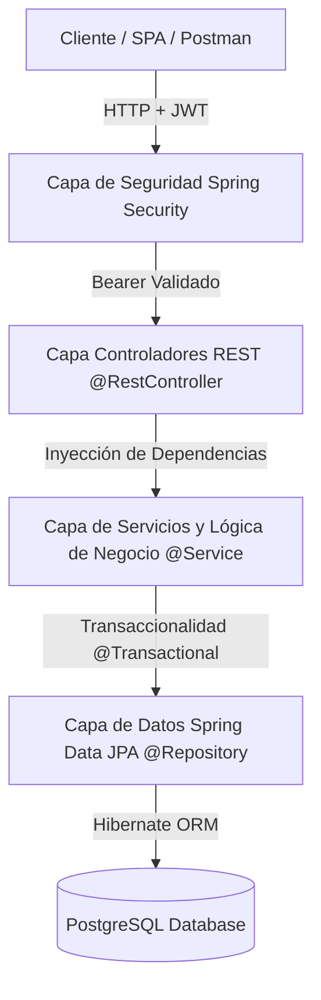
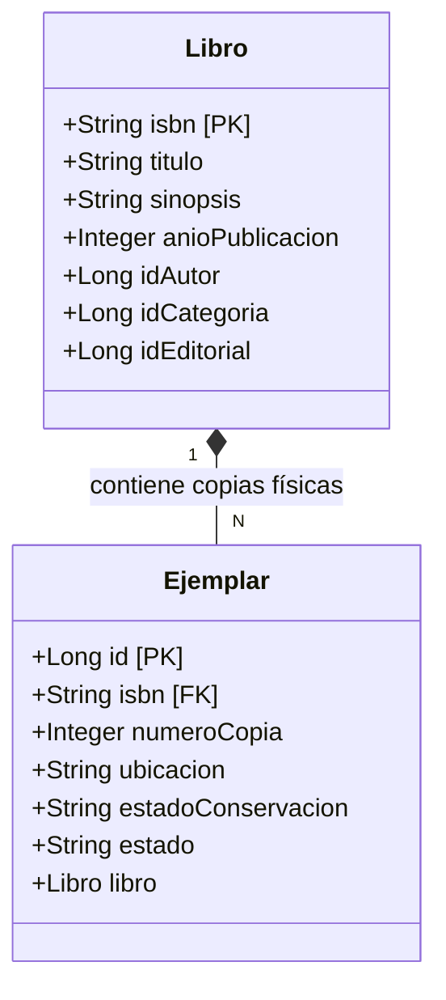
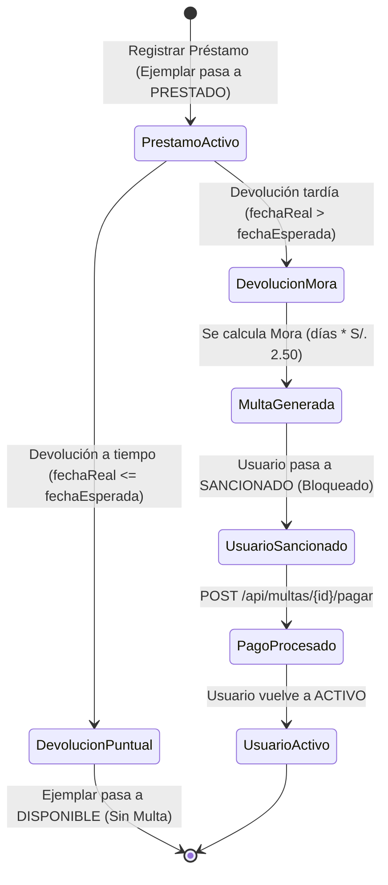
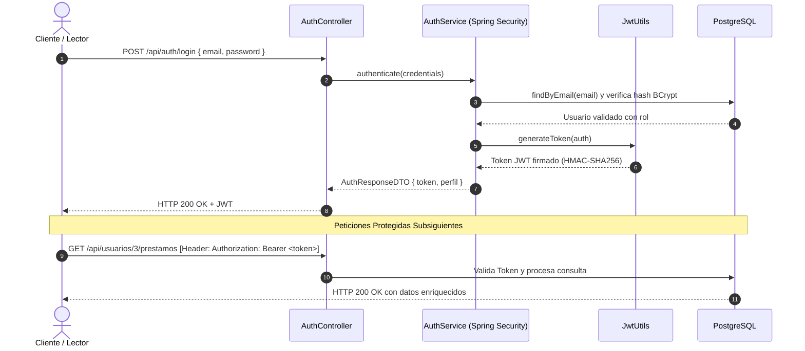

# 📖 Wiki Oficial - Sistema de Gestión de Biblioteca

Bienvenido a la **Wiki Oficial del Proyecto Biblioteca**, desarrollada para la asignatura de *Desarrollo Web Integrado*. Este documento recopila toda la información arquitectónica, flujos de datos, especificaciones de seguridad, modelo relacional y manual de referencia de la API RESTful.

---

## 📑 Tabla de Contenidos de la Wiki

1. [Página 1: Visión General y Objetivos](#1-visión-general-y-objetivos)
2. [Página 2: Arquitectura del Sistema y Tecnologías](#2-arquitectura-del-sistema-y-tecnologías)
3. [Página 3: Modelo Conceptual (Libro ISBN vs. Ejemplar Físico)](#3-modelo-conceptual-libro-isbn-vs-ejemplar-físico)
4. [Página 4: Ciclo de Préstamos, Devoluciones y Multas con LocalDateTime](#4-ciclo-de-préstamos-devoluciones-y-multas-con-localdatetime)
5. [Página 5: Seguridad, Autenticación JWT y Roles](#5-seguridad-autenticación-jwt-y-roles)
6. [Página 6: Esquema Relacional de Base de Datos (PostgreSQL)](#6-esquema-relacional-de-base-de-datos-postgresql)
7. [Página 7: Manual de Referencia de la API REST](#7-manual-de-referencia-de-la-api-rest)
8. [Página 8: Guía de Instalación, Configuración y Pruebas con Postman](#8-guía-de-instalación-configuración-y-pruebas-con-postman)

---

## 1. Visión General y Objetivos

El sistema automatiza la gestión integral de una biblioteca moderna:
* **Catálogo Centralizado:** Registro de libros identificados por su código universal **ISBN**.
* **Gestión de Stock Tangible:** Control de múltiples **ejemplares físicos** por obra intelectual.
* **Circulación Eficiente:** Préstamos y devoluciones con control exacto de fecha y hora (`LocalDateTime`).
* **Fiscalización Automatizada:** Cálculo inmediato de mora en horas/días de retraso, bloqueo y desbloqueo de usuarios.
* **Seguridad Profesional:** Control de acceso mediante tokens **JWT** y contraseñas cifradas en **BCrypt**.

---

## 2. Arquitectura del Sistema y Tecnologías

El proyecto sigue el patrón de **Arquitectura en Capas (Layered Architecture)** para garantizar bajo acoplamiento y alta cohesión:



### Stack Tecnológico:
* **Lenguaje:** Java 21 LTS
* **Framework:** Spring Boot 4.x / 3.x
* **Acceso a Datos:** Spring Data JPA / Hibernate
* **Motor de Base de Datos:** PostgreSQL
* **Seguridad:** Spring Security 6.x + JJWT (Java JWT 0.12.x)
* **Utilidades:** Project Lombok, Jakarta Bean Validation

---

## 3. Modelo Conceptual (Libro ISBN vs. Ejemplar Físico)

En la teoría de bibliotecología, existe una distinción estricta entre la obra intelectual y el objeto físico:



* **`Libro`**: Representa la ficha bibliográfica. Su identificador principal es el **`isbn`** (ej. `"978-0307474728"`).
* **`Ejemplar`**: Cada libro físico tangible en estantes. Posee su propio identificador, número de copia, ubicación (`"Estante A-1, Fila 2"`) y estado (`DISPONIBLE`, `PRESTADO`, `EN_MANTENIMIENTO`, `DADO_DE_BAJA`).
* **Regla:** Los préstamos se realizan siempre sobre un `idEjemplar` concreto.

---

## 4. Ciclo de Préstamos, Devoluciones y Multas con LocalDateTime

El sistema implementa un motor de reglas de negocio con precisión temporal:



### Reglas Clave:
1. **Préstamo:** Valida que el `Usuario` esté `ACTIVO` (sin sanciones) y que el `Ejemplar` esté `DISPONIBLE`.
2. **Plazo por defecto:** 14 días calendario a partir de `fechaHoraPrestamo`.
3. **Devolución:** Se compara `fechaHoraDevolucionReal` contra `fechaHoraDevolucionEsperada`.
4. **Cálculo de Multa:**
   $$\text{Monto} = \text{Días de retraso} \times \text{S/. 2.50}$$
5. **Pago de Multa:** Al pagar la totalidad de la deuda, se genera un comprobante de auditoría y se reactiva al usuario.

---

## 5. Seguridad, Autenticación JWT y Roles

### Flujo de Autenticación Stateless:



### Usuarios y Roles Semilla:
* **Admin:** `admin@biblioteca.com` / `admin123` (`ROLE_ADMIN`)
* **Bibliotecario:** `bibliotecario@biblioteca.com` / `biblio123` (`ROLE_BIBLIOTECARIO`)
* **Estudiante:** `carlos.mendoza@email.com` / `carlos123` (`ROLE_ESTUDIANTE`)
* **Docente:** `lucia.fernandez@email.com` / `lucia123` (`ROLE_DOCENTE`)

---

## 6. Esquema Relacional de Base de Datos (PostgreSQL)

```sql
-- Tablas principales creadas automáticamente por Hibernate DDL:
-- 1. autores (id SERIAL PRIMARY KEY, nombre, nacionalidad, biografia)
-- 2. categorias (id SERIAL PRIMARY KEY, nombre UNIQUE, descripcion)
-- 3. editoriales (id SERIAL PRIMARY KEY, nombre UNIQUE, pais, contacto)
-- 4. libros (isbn VARCHAR(20) PRIMARY KEY, titulo, sinopsis, id_autor, id_categoria, id_editorial, anio_publicacion)
-- 5. ejemplares (id SERIAL PRIMARY KEY, isbn FK -> libros, numero_copia, ubicacion, estado_conservacion, estado)
-- 6. usuarios (id SERIAL PRIMARY KEY, dni UNIQUE, nombre, email UNIQUE, password, telefono, direccion, tipo_usuario, rol, estado)
-- 7. prestamos (id SERIAL PRIMARY KEY, id_ejemplar FK, id_usuario FK, fecha_hora_prestamo, fecha_hora_devolucion_esperada, fecha_hora_devolucion_real, estado)
-- 8. multas (id SERIAL PRIMARY KEY, id_prestamo FK, id_usuario FK, tipo_multa, horas_retraso, dias_retraso, monto, motivo, fecha_hora_emision, estado)
-- 9. pagos_multas (id SERIAL PRIMARY KEY, id_multa FK, monto_pagado, fecha_hora_pago, metodo_pago, comprobante)
-- 10. reservas (id SERIAL PRIMARY KEY, isbn FK, id_usuario FK, fecha_hora_reserva, fecha_hora_expiracion, estado)
```

---

## 7. Manual de Referencia de la API REST

### Resumen de Endpoints Principales:

| Módulo | Método | Endpoint | Nivel de Acceso | Descripción |
|---|:---:|---|:---:|---|
| **Auth** | `POST` | `/api/auth/login` | Público | Autenticar y recibir Token JWT |
| **Auth** | `POST` | `/api/auth/register` | Público | Registrar nuevo usuario |
| **Auth** | `GET` | `/api/auth/me` | Autenticado | Ver perfil del usuario logueado |
| **Libros** | `GET` | `/api/libros` | Público | Listar todos los libros |
| **Libros** | `GET` | `/api/libros/{isbn}` | Público | Buscar libro por código ISBN |
| **Libros** | `GET` | `/api/libros/{isbn}/ejemplares` | Público | Listar copias físicas de un ISBN |
| **Ejemplares** | `GET` | `/api/ejemplares` | Público | Listar inventario físico |
| **Ejemplares** | `POST` | `/api/ejemplares` | Autenticado | Dar de alta nueva copia en estante |
| **Usuarios** | `GET` | `/api/usuarios/{id}/prestamos` | Autenticado | **Historial detallado de préstamos** |
| **Usuarios** | `GET` | `/api/usuarios/{id}/prestamos/activos` | Autenticado | **Libros que tiene prestados actualmente** |
| **Préstamos** | `POST` | `/api/prestamos` | Autenticado | Registrar nuevo préstamo |
| **Préstamos** | `PUT` | `/api/prestamos/{id}/devolver` | Autenticado | **Devolución física con cálculo de mora** |
| **Multas** | `POST` | `/api/multas/{id}/pagar` | Autenticado | **Pagar multa, emitir boleta y desbloquear** |
| **Reportes** | `GET` | `/api/reportes/dashboard` | Público | Dashboard estadístico general |

---

## 8. Guía de Instalación, Configuración y Pruebas con Postman

1. **Crear Base de Datos en PostgreSQL:**
   ```sql
   CREATE DATABASE biblioteca_db;
   ```
2. **Ejecutar la Aplicación:**
   ```bash
   ./mvnw spring-boot:run
   ```
3. **Importar Colección en Postman:**
   * Importar `ProyectoBiblioteca.postman_collection.json`.
   * Ejecutar la petición `0. Autenticación & JWT -> Login Administrador`.
   * El token se almacena automáticamente en `{{token}}` para todas las demás peticiones.
