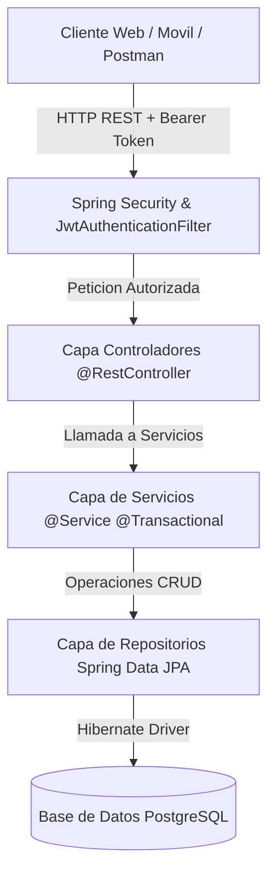

# Arquitectura y Tecnologias

Esta pagina describe la arquitectura de software del backend y el ecosistema tecnologico empleado en la solucion.

---

## Patron Arquitectonico en Capas (Layered Architecture)

La arquitectura sigue el patron clasico en capas desacopladas, lo que permite modificar o extender la persistencia o presentacion sin alterar el nucleo del negocio:



### Descripcion de las Capas:

1. **Capa de Controladores (Presentation Layer):**
   * Ubicacion: `com.proyecto.biblioteca.controllers`
   * Responsabilidad: Recibir peticiones HTTP, parsear cuerpos JSON, ejecutar validaciones de entrada (`@Valid`) y emitir respuestas estandarizadas con codigos HTTP semanticos (`ResponseEntity`).

2. **Capa de Seguridad (Security Layer):**
   * Ubicacion: `com.proyecto.biblioteca.security`
   * Responsabilidad: Interceptar peticiones mediante `JwtAuthenticationFilter`, validar firmas HMAC-SHA256 y poblar el `SecurityContextHolder`. Control de excepciones no autorizadas con `JwtAuthenticationEntryPoint`.

3. **Capa de Logica de Negocio (Service Layer):**
   * Ubicacion: `com.proyecto.biblioteca.services`
   * Responsabilidad: Orquestar transacciones (`@Transactional`), aplicar reglas de prestamos, calcular moras, sancionar o reactivar usuarios y enriquecer respuestas con DTOs.

4. **Capa de Acceso a Datos (Persistence Layer):**
   * Ubicacion: `com.proyecto.biblioteca.repositories`
   * Responsabilidad: Extender `JpaRepository<T, ID>` para realizar operaciones sobre PostgreSQL mediante consultas derivadas y metodos tipados.

5. **Capa de Modelo y DTOs (Domain Layer):**
   * Ubicacion: `com.proyecto.biblioteca.models` y `com.proyecto.biblioteca.dto`
   * Responsabilidad: Mapear tablas relacionales a objetos Java con anotaciones JPA (`@Entity`, `@Table`, `@Id`, `@ManyToOne`, `@JoinColumn`) y transferir contratos de datos especificos.

---

## Ecosistema Tecnologico

| Tecnologia | Version | Proposito |
|---|---|---|
| Java LTS | 21 | Lenguaje de programacion base |
| Spring Boot | 4.x / 3.x | Framework de aplicacion backend |
| Spring Data JPA | Incluida | Abstraccion ORM con Hibernate |
| PostgreSQL | 14+ | Sistema Gestor de Base de Datos Relacional |
| Spring Security | 6.x | Marco de autenticacion y autorizacion |
| JJWT (io.jsonwebtoken) | 0.12.6 | Generacion y validacion de JSON Web Tokens |
| Lombok | 1.18.x | Reduccion de codigo boilerplate (getters, setters, constructores) |
| Jakarta Validation | 3.x | Validacion declarativa de campos (@NotBlank, @NotNull, @Email, @Min) |

---

## Estructura de Paquetes

```
com.proyecto.biblioteca
├── BibliotecaApplication.java
├── config
│   └── DataInitializer.java
├── controllers
│   ├── AuthController.java
│   ├── AutorController.java
│   ├── CategoriaController.java
│   ├── EditorialController.java
│   ├── EjemplarController.java
│   ├── GlobalExceptionHandler.java
│   ├── HomeController.java
│   ├── LibroController.java
│   ├── MultaController.java
│   ├── PagoMultaController.java
│   ├── PrestamoController.java
│   ├── ReporteController.java
│   └── UsuarioController.java
├── dto
│   ├── AuthResponseDTO.java
│   ├── DevolucionRequestDTO.java
│   ├── LoginRequestDTO.java
│   ├── PagoMultaRequestDTO.java
│   ├── PrestamoDetalladoDTO.java
│   └── RegisterRequestDTO.java
├── models
│   ├── Autor.java
│   ├── Categoria.java
│   ├── Editorial.java
│   ├── Ejemplar.java
│   ├── Libro.java
│   ├── Multa.java
│   ├── PagoMulta.java
│   ├── Prestamo.java
│   ├── Reserva.java
│   └── Usuario.java
├── repositories
│   ├── AutorRepository.java
│   ├── CategoriaRepository.java
│   ├── EditorialRepository.java
│   ├── EjemplarRepository.java
│   ├── LibroRepository.java
│   ├── MultaRepository.java
│   ├── PagoMultaRepository.java
│   ├── PrestamoRepository.java
│   ├── ReservaRepository.java
│   └── UsuarioRepository.java
└── security
    ├── CustomUserDetailsService.java
    ├── JwtAuthenticationEntryPoint.java
    ├── JwtAuthenticationFilter.java
    ├── JwtUtils.java
    └── SecurityConfig.java
```
