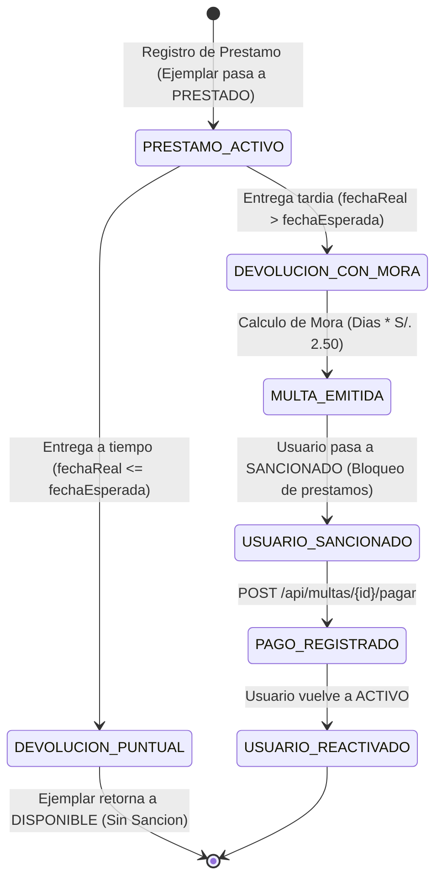

# Ciclo de Prestamos, Devoluciones y Multas

Esta pagina describe las reglas de negocio aplicadas en la circulacion de libros, el calculo automatizado de mora mediante `LocalDateTime` y el flujo de desbloqueo de usuarios sancionados.

---

## 1. Diagrama de Estados del Prestamo

---

## 2. Reglas del Registro de Prestamo

Al enviar una solicitud `POST /api/prestamos`:
1. **Validacion de Lector:**
   * El usuario debe existir en la base de datos.
   * El usuario debe contar con estado `ACTIVO`. Si se encuentra `SANCIONADO`, el sistema rechaza la operacion con un error `409 Conflict`.
2. **Validacion de Ejemplar:**
   * El ejemplar fisico debe existir.
   * El estado del ejemplar debe ser `DISPONIBLE`. Si se encuentra `PRESTADO` o `EN_MANTENIMIENTO`, se rechaza con `409 Conflict`.
3. **Asignacion Temporal:**
   * Si no se envia fecha de prestamo, se asigna `LocalDateTime.now()`.
   * La fecha esperada de devolucion se calcula por defecto sumando **14 dias calendario** a la fecha de prestamo.
4. **Mutacion de Estado:**
   * El ejemplar cambia su estado a `PRESTADO`.

---

## 3. Evaluacion en Devolucion (`PUT /api/prestamos/{id}/devolver`)

Al procesar la recepcion fisica del libro, el servicio evalua:

$$\text{Mora} = \text{fechaHoraDevolucionReal} - \text{fechaHoraDevolucionEsperada}$$

### Caso A: Devolucion Puntual o Anticipada
* Condicion: `fechaHoraDevolucionReal <= fechaHoraDevolucionEsperada`
* Accion:
  * El prestamo pasa al estado `DEVUELTO`.
  * El ejemplar regresa a estado `DISPONIBLE` (segun su estado de conservacion).
  * No se genera ningun cobro adicional ni sancion.

### Caso B: Devolucion con Retraso (Mora Temporal)
* Condicion: `fechaHoraDevolucionReal > fechaHoraDevolucionEsperada`
* Accion:
  1. Se calcula la diferencia exacta en horas con `Duration.between(...)`.
  2. Se calculan los dias de mora: `diasRetraso = Math.ceil(horas / 24.0)`.
  3. Se determina el importe de penalizacion:
     $$\text{Monto Multa} = \text{diasRetraso} \times \text{S/. 2.50}$$
  4. Se inserta automaticamente una `Multa` en estado `PENDIENTE` vinculada al prestamo y al usuario.
  5. El usuario pasa inmediatamente al estado **`SANCIONADO`**.

### Caso C: Evaluacion de Deterioro o Dano Fisico
* Si el bibliotecario reporta estado `DETERIORADO` o `DANADO` en el DTO de devolucion:
  * Se emite una `Multa` de tipo `DANO` con el importe correspondiente a la reparacion o reposicion.
  * El ejemplar pasa al estado `EN_MANTENIMIENTO`.
  * El usuario queda `SANCIONADO`.

---

## 4. Circuito de Pago y Levantamiento de Sancion (`POST /api/multas/{id}/pagar`)

1. El cliente envía el monto a pagar, metodo (`EFECTIVO`, `TARJETA`, `TRANSFERENCIA`) y numero de comprobante opcional.
2. El sistema valida que el importe cubra la deuda.
3. Se actualiza la multa a estado `PAGADA`.
4. Se emite el registro en `pagos_multas` con codigo de comprobante unico (`BOL-XXXXXXXX`).
5. **Auditoria de Deuda Restante:** Se verifica si el usuario tiene mas multas en estado `PENDIENTE`. Si no registra mas deudas, su estado se reactiva de forma automatica a **`ACTIVO`**, permitiendole solicitar nuevos prestamos de inmediato.
