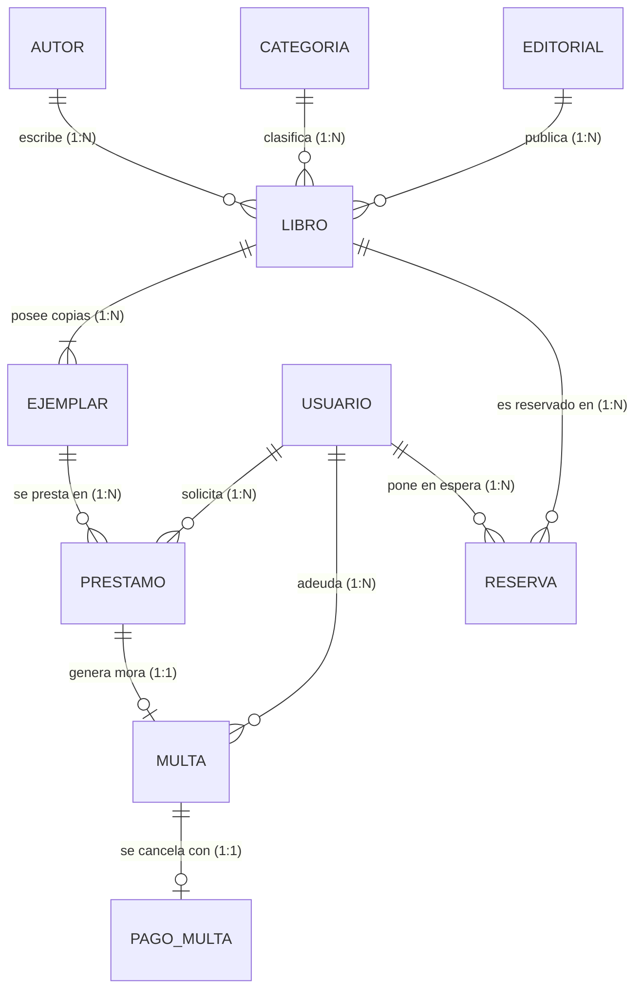

# Modelo de Datos y Base de Datos (PostgreSQL)

Esta pagina detalla el diseno relacional, la distincion conceptual de inventario y el diccionario de datos de las entidades persistidas en PostgreSQL.

---

## 1. Distincion Conceptual: Libro (ISBN) vs. Ejemplar Fisico

En el diseno de una biblioteca real, un libro es una obra abstracta catalogada, mientras que los ejemplares son las unidades fisicas reales que se colocan en estanterias y se entregan a los lectores:

* **Entidad `Libro`:**
  * Identificador Principal: `isbn` (String, Primary Key).
  * No utiliza identificadores numericos artificiales.
  * Agrupa titulo, sinopsis, ano de publicacion, autor, categoria y editorial.
* **Entidad `Ejemplar`:**
  * Identificador Principal: `id` (Long, Primary Key auto-incremental).
  * Clave Foranea: `isbn` (apunta a la entidad `Libro`).
  * Atributos fisicos: `numeroCopia` (1, 2, 3...), `ubicacion` ("Estante A-1, Nivel 2"), `estadoConservacion` ("EXCELENTE", "BUENO", "DETERIORADO") y `estado` ("DISPONIBLE", "PRESTADO", "EN_MANTENIMIENTO", "DADO_DE_BAJA").
  * Contiene embebida la referencia completa al objeto `Libro`.

---

## 2. Diagrama Entidad-Relacion (DER)

---

## 3. Diccionario de Tablas en PostgreSQL

### Tabla `autores`
| Columna | Tipo de Dato | Restricciones | Descripcion |
|---|---|---|---|
| `id` | BIGSERIAL | PRIMARY KEY | Identificador unico del autor |
| `nombre` | VARCHAR(255) | NOT NULL | Nombre y apellidos del autor |
| `nacionalidad` | VARCHAR(100) | NULL | Pais de origen |
| `biografia` | TEXT | NULL | Resena biografica |
| `activo` | BOOLEAN | NOT NULL, DEFAULT TRUE | Estado logico del registro (Soft Delete) |

### Tabla `categorias`
| Columna | Tipo de Dato | Restricciones | Descripcion |
|---|---|---|---|
| `id` | BIGSERIAL | PRIMARY KEY | Identificador unico |
| `nombre` | VARCHAR(100) | NOT NULL, UNIQUE | Genero literario o tematica |
| `descripcion` | TEXT | NULL | Descripcion de la categoria |
| `activo` | BOOLEAN | NOT NULL, DEFAULT TRUE | Estado logico del registro (Soft Delete) |

### Tabla `editoriales`
| Columna | Tipo de Dato | Restricciones | Descripcion |
|---|---|---|---|
| `id` | BIGSERIAL | PRIMARY KEY | Identificador unico |
| `nombre` | VARCHAR(150) | NOT NULL, UNIQUE | Razon social o nombre comercial |
| `pais` | VARCHAR(100) | NULL | Pais de la editorial |
| `contacto` | VARCHAR(150) | NULL | Correo o telefono de contacto |
| `activo` | BOOLEAN | NOT NULL, DEFAULT TRUE | Estado logico del registro (Soft Delete) |

### Tabla `libros`
| Columna | Tipo de Dato | Restricciones | Descripcion |
|---|---|---|---|
| `isbn` | VARCHAR(20) | PRIMARY KEY | Codigo ISBN estandar internacional |
| `titulo` | VARCHAR(255) | NOT NULL | Titulo de la obra |
| `sinopsis` | TEXT | NULL | Resumen del contenido |
| `id_autor` | BIGINT | NOT NULL, FK -> autores(id) | Autor de la obra |
| `id_categoria` | BIGINT | NOT NULL, FK -> categorias(id) | Categoria tematica |
| `id_editorial` | BIGINT | NOT NULL, FK -> editoriales(id) | Casa editorial |
| `anio_publicacion` | INTEGER | NOT NULL | Ano de edicion |
| `activo` | BOOLEAN | NOT NULL, DEFAULT TRUE | Estado logico del registro (Soft Delete) |

### Tabla `ejemplares`
| Columna | Tipo de Dato | Restricciones | Descripcion |
|---|---|---|---|
| `id` | BIGSERIAL | PRIMARY KEY | Codigo de inventario fisico |
| `isbn` | VARCHAR(20) | NOT NULL, FK -> libros(isbn) | Referencia al titulo |
| `numero_copia` | INTEGER | NOT NULL | Numero de copia fisica (1, 2, 3...) |
| `ubicacion` | VARCHAR(150) | NULL | Codigo de estante o pasillo |
| `estado_conservacion` | VARCHAR(30) | DEFAULT 'BUENO' | EXCELENTE, BUENO, DETERIORADO |
| `estado` | VARCHAR(30) | DEFAULT 'DISPONIBLE' | DISPONIBLE, PRESTADO, EN_MANTENIMIENTO |
| `activo` | BOOLEAN | NOT NULL, DEFAULT TRUE | Estado logico del registro (Soft Delete) |

### Tabla `usuarios`
| Columna | Tipo de Dato | Restricciones | Descripcion |
|---|---|---|---|
| `id` | BIGSERIAL | PRIMARY KEY | Identificador unico de usuario |
| `dni` | VARCHAR(15) | UNIQUE, NULL | Documento Nacional de Identidad |
| `nombre` | VARCHAR(255) | NOT NULL | Nombre completo |
| `email` | VARCHAR(150) | NOT NULL, UNIQUE | Correo electronico (Username de login) |
| `password` | VARCHAR(255) | NOT NULL | Hash cifrado con algoritmo BCrypt |
| `telefono` | VARCHAR(30) | NULL | Numero telefonico de contacto |
| `direccion` | VARCHAR(255) | NULL | Domicilio |
| `tipo_usuario` | VARCHAR(30) | DEFAULT 'ESTUDIANTE' | ESTUDIANTE, DOCENTE, EXTERNO |
| `rol` | VARCHAR(30) | DEFAULT 'ROLE_ESTUDIANTE' | ROLE_ADMIN, ROLE_BIBLIOTECARIO, etc. |
| `estado` | VARCHAR(30) | DEFAULT 'ACTIVO' | ACTIVO, SANCIONADO, INACTIVO |
| `activo` | BOOLEAN | NOT NULL, DEFAULT TRUE | Estado logico del registro (Soft Delete) |

### Tabla `prestamos`
| Columna | Tipo de Dato | Restricciones | Descripcion |
|---|---|---|---|
| `id` | BIGSERIAL | PRIMARY KEY | Identificador del prestamo |
| `id_ejemplar` | BIGINT | NOT NULL, FK -> ejemplares(id) | Copia fisica prestada |
| `id_usuario` | BIGINT | NOT NULL, FK -> usuarios(id) | Lector que solicita el material |
| `fecha_hora_prestamo` | TIMESTAMP | NOT NULL | Momento exacto de entrega |
| `fecha_hora_devolucion_esperada` | TIMESTAMP | NOT NULL | Plazo limite fijado |
| `fecha_hora_devolucion_real` | TIMESTAMP | NULL | Momento exacto de retorno fisico |
| `estado` | VARCHAR(30) | DEFAULT 'ACTIVO' | ACTIVO, DEVUELTO, VENCIDO |
| `activo` | BOOLEAN | NOT NULL, DEFAULT TRUE | Estado logico del registro (Soft Delete) |

### Tabla `multas`
| Columna | Tipo de Dato | Restricciones | Descripcion |
|---|---|---|---|
| `id` | BIGSERIAL | PRIMARY KEY | Identificador de sancion |
| `id_prestamo` | BIGINT | NOT NULL, FK -> prestamos(id) | Prestamo que genero la mora |
| `id_usuario` | BIGINT | NOT NULL, FK -> usuarios(id) | Usuario infractor |
| `tipo_multa` | VARCHAR(30) | DEFAULT 'RETRASO' | RETRASO, DANO, EXTRAVIO |
| `horas_retraso` | BIGINT | DEFAULT 0 | Horas exactas excedidas |
| `dias_retraso` | INTEGER | DEFAULT 0 | Dias de mora calculados |
| `monto` | NUMERIC(10,2) | NOT NULL | Monto economico a cancelar |
| `motivo` | TEXT | NULL | Justificacion de la sancion |
| `fecha_hora_emision` | TIMESTAMP | NOT NULL | Momento de emision |
| `estado` | VARCHAR(30) | DEFAULT 'PENDIENTE' | PENDIENTE, PAGADA, ANULADA |
| `activo` | BOOLEAN | NOT NULL, DEFAULT TRUE | Estado logico del registro (Soft Delete) |

### Tabla `pagos_multas`
| Columna | Tipo de Dato | Restricciones | Descripcion |
|---|---|---|---|
| `id` | BIGSERIAL | PRIMARY KEY | Identificador de transaccion |
| `id_multa` | BIGINT | NOT NULL, FK -> multas(id) | Multa cancelada |
| `monto_pagado` | NUMERIC(10,2) | NOT NULL | Importe recaudado |
| `fecha_hora_pago` | TIMESTAMP | NOT NULL | Momento exacto del cobro |
| `metodo_pago` | VARCHAR(30) | DEFAULT 'EFECTIVO' | EFECTIVO, TARJETA, TRANSFERENCIA |
| `comprobante` | VARCHAR(50) | NULL | Codigo de boleta o recibo |
| `activo` | BOOLEAN | NOT NULL, DEFAULT TRUE | Estado logico del registro (Soft Delete) |

### Tabla `reservas`
| Columna | Tipo de Dato | Restricciones | Descripcion |
|---|---|---|---|
| `id` | BIGSERIAL | PRIMARY KEY | Identificador de reserva |
| `isbn` | VARCHAR(20) | NOT NULL, FK -> libros(isbn) | Libro solicitado |
| `id_usuario` | BIGINT | NOT NULL, FK -> usuarios(id) | Usuario en cola de espera |
| `fecha_hora_reserva` | TIMESTAMP | NOT NULL | Momento de solicitud |
| `fecha_hora_expiracion` | TIMESTAMP | NULL | Plazo maximo de reserva |
| `estado` | VARCHAR(30) | DEFAULT 'PENDIENTE' | PENDIENTE, ATENDIDA, CANCELADA |
| `activo` | BOOLEAN | NOT NULL, DEFAULT TRUE | Estado logico del registro (Soft Delete) |

---

## 4. Politica de Eliminacion Logica (Soft Delete)

El sistema implementa una arquitectura de **Soft Delete** en el 100% de las tablas:
* Ninguna peticion `DELETE` realiza un `DELETE FROM ...` en la base de datos.
* Al ejecutar una operacion de eliminacion en la API, el servicio actualiza `activo = false` y persiste el cambio.
* Las consultas de lectura (`listarTodos`, busquedas por identificador o filtros por atributos) filtran exclusivamente registros donde `activo = true` (`findByActivoTrue()`).
* Esto garantiza la trazabilidad historica, la integridad referencial y la recuperabilidad de auditoria en auditorias academicas y corporativas.

