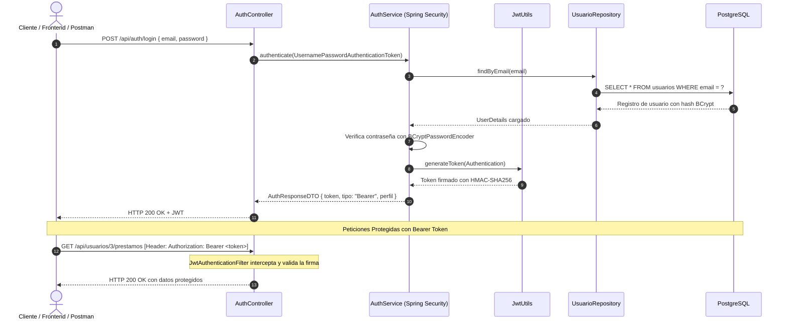

# Seguridad, Autenticacion y JWT

Esta pagina describe la arquitectura de seguridad implementada con **Spring Security** y **JSON Web Tokens (JWT)**.

---

## 1. Diagrama de Secuencia de Autenticacion

---

## 2. Componentes de Seguridad

1. **`SecurityConfig.java`:**
   * Declara la cadena de filtros `SecurityFilterChain`.
   * Desactiva CSRF (innecesario para APIs REST stateless).
   * Configura la politica de sesiones como `SessionCreationPolicy.STATELESS`.
   * Habilita CORS para permitir integraciones con cualquier origen frontend.
   * Asigna permisos publicos a `/api/auth/**`, `/`, y metodos `GET` de catalogo.

2. **`JwtUtils.java`:**
   * Utiliza la libreria JJWT 0.12.x.
   * Clave secreta configurada mediante la propiedad `app.jwt.secret` (256 bits).
   * Genera tokens con claims de usuario, roles y fecha de expiracion (24 horas por defecto).

3. **`JwtAuthenticationFilter.java`:**
   * Filtro `OncePerRequestFilter` que intercepta cada peticion entrante.
   * Extrae la cadena posterior al prefijo `Bearer `.
   * Si el token es valido, construye un `UsernamePasswordAuthenticationToken` y lo inyecta en el `SecurityContextHolder`.

4. **`JwtAuthenticationEntryPoint.java`:**
   * Captura cualquier fallo de autenticacion y retorna una respuesta JSON limpia con codigo `401 Unauthorized`.

5. **`CustomUserDetailsService.java`:**
   * Implementa `UserDetailsService` para consultar los usuarios en PostgreSQL y mapear sus roles como `GrantedAuthority`.

---

## 3. Politica de Roles y Permisos

| Rol | Descripcion | Permisos |
|---|---|---|
| `ROLE_ADMIN` | Administrador General | Acceso irrestricto a todos los endpoints, gestion de usuarios y reportes |
| `ROLE_BIBLIOTECARIO` | Personal de Biblioteca | Registro y baja de libros, ejemplares, recepcion de devoluciones y cobro de multas |
| `ROLE_DOCENTE` | Docente Lector | Consulta de catalogo, solicitud de prestamos y visualizacion de sus prestamos |
| `ROLE_ESTUDIANTE` | Estudiante Lector | Consulta de catalogo, solicitud de prestamos y pago de sus multas |

---

## 4. Usuarios Semilla Precargados

| Rol | Email | Contraseña |
|---|---|---|
| ROLE_ADMIN | admin@biblioteca.com | admin123 |
| ROLE_BIBLIOTECARIO | bibliotecario@biblioteca.com | biblio123 |
| ROLE_ESTUDIANTE | carlos.mendoza@email.com | carlos123 |
| ROLE_DOCENTE | lucia.fernandez@email.com | lucia123 |
